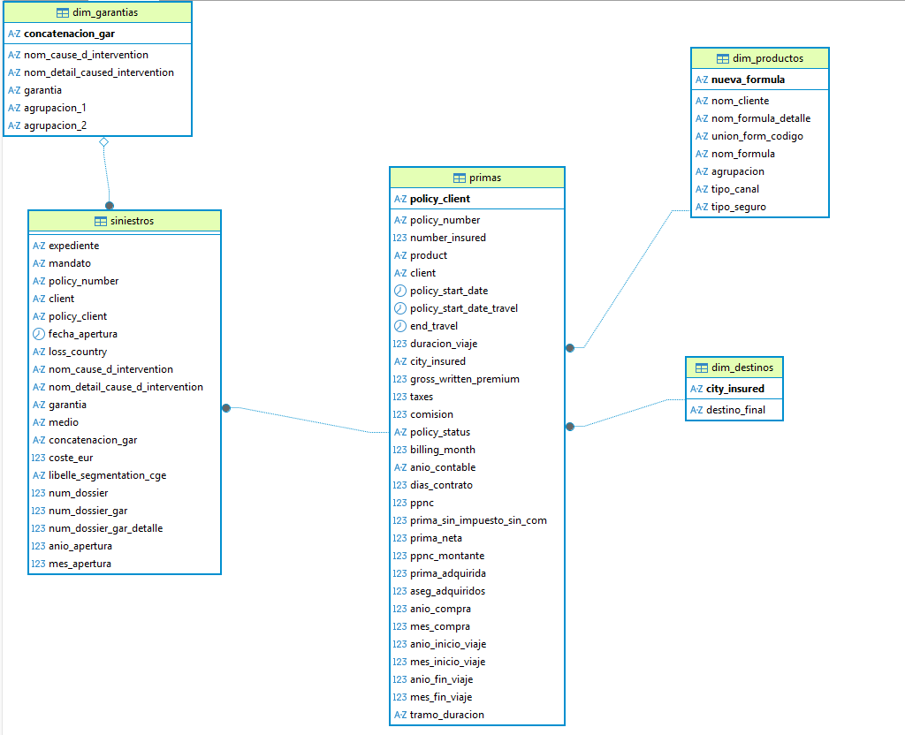

<style>
  body {
    text-align: justify;
  }
</style>


<style>

pre {
  background-color: #f2f2f2 !important; /* Gris muy claro */
  border: 1px solid #d9d9d9;          /* Un borde suave */
}

/* Esto cambia el color de fondo de los resultados del código */
code {
  background-color: #f2f2f2 !important;
  color: black !important;
}
</style>


```{=html}
<script>
   $(document).ready(function() {
     $head = $('#header');
     $head.prepend('')
   });
</script>
```

<br>


# 1. Resumen Ejecutivo

<br>

Este resumen ejecutivo sintetiza el planteamiento, la metodología y los hallazgos críticos del análisis técnico-financiero aplicado a la cartera de seguros de viaje de la entidad aseguradora (660.431 observaciones) durante el trienio histórico acumulado 2023-2025.

La entidad presentaba una inconsistencia técnica y financiera en el margen de su cartera de seguros de viaje, caracterizada por una alta exposición a pérdidas y una fuerte erosión de la rentabilidad neta. Este problema estructural estaba motivado, en primer lugar, por una infratarificación estructural visible en la devaluación sistemática de la prima emitida media en los canales de mediación y colectivos (B2B), donde los precios promedio cayeron de forma de los $18$ € a solo $12$ € por asegurado, resultando del todo insuficientes para absorber la siniestralidad de la cartera. En segundo lugar, se sumaba la erosión provocada por los altos costes de adquisición bajo un esquema de comisiones sumamente rígido con determinados intermediarios, alcanzando tasas medias de comisión de hasta el $40\%$ que asfixiaban directamente el ratio combinado neto de la compañía. Finalmente, el tercer factor crítico de pérdida radicaba en la falta de control en la acumulación de riesgos debido a una excesiva concentración de pólizas colectivas masivas sin recargos específicos por tamaño de grupo, lo que disparaba la probabilidad de registrar siniestros de alta severidad médica en el extranjero que superaban con creces los costes medios habituales de $800$ € y llegaban a registrar picos individuales catastróficos de hasta $389.782,27$ € en el destino Mundo.


Para diagnosticar y modelar el comportamiento del riesgo de la cartera de forma científica, se llevó a cabo un análisis multidimensional integral estructurado en tres dimensiones clave que abarcan los canales de distribución, las líneas de producto y los corredores, mediante la integración de tres disciplinas tecnológicas fundamentales. En primer lugar, en el área de la ingeniería de datos sobre la plataforma PostgreSQL, se implementó un proceso ETL de limpieza y calidad de datos diseñado para corregir anomalías severas como duraciones de viaje nulas o negativas, estructurando una capa semántica de vistas lógicas optimizadas para su posterior explotación analítica. A continuación, en la vertiente de la inteligencia de negocio con Power BI, se construyó un modelo dimensional en estrella y se programaron métricas DAX específicas del sector asegurador —tales como Loss Ratio, Prima Media por Asegurado, Coste Medio por Expediente y Ratio Combinado con Comisiones— para evaluar de forma interactiva la rentabilidad acumulada y anual de cada segmento. Por último, en la fase del modelado de análisis predictivo mediante Python, dado que la siniestralidad de la cartera presenta una distribución de cola pesada extrema con una inflación de ceros superior al $75\%$, se entrenaron modelos de regresión logística de alta significatividad estadística ($p = 0.000$) orientados a predecir la probabilidad de ocurrencia de un siniestro en función de la duración del viaje, el tamaño del grupo y la segmentación del destino geográfico.


Los resultados más significativos obtenidos del estudio permitieron establecer decisiones estratégicas clave para la supervivencia financiera de la compañía. En primer lugar, se evidenció una marcada asimetría de canales, donde el canal directo B2C se consolidó como el pilar de solvencia de la aseguradora (alcanzando el $85\%$ de la producción en 2025) gracias a su sólido poder de fijación de precios, que elevó la prima media a $58$ € y mantuvo un Ratio Combinado saludable del $80,94\%$, mientras que el canal B2B se desplomó técnicamente hasta entrar en pérdidas con un Ratio Combinado del $100,26\%$ debido a tarifas insostenibles. En segundo lugar, los modelos predictivos confirmaron el impacto exponencial de los grupos y el destino, determinando que, aunque cada día adicional de viaje incrementa la probabilidad de siniestro en un $1,20\%$ ($OR = 1,0120$), el verdadero multiplicador es el tamaño del grupo en viajes internacionales; mientras que en el destino Nacional cada persona adicional en la póliza eleva el riesgo un moderado $+2,45\%$, en la modalidad Mundo el riesgo se dispara un $+13,57\%$ por cada asegurado adicional ($OR = 1,1357$), exigiendo la aplicación inmediata de tarifas dinámicas con recargos por grupo. En tercer lugar, se constató un saneamiento exitoso de productos deficitarios como Schengen, que tras encadenar pérdidas severas en 2023 ($133,18\%$) y 2024 ($106,92\%$), fue objeto de una contracción preventiva del negocio del $-70,6\%$ en 2025, logrando depurar la cartera y reconducir su Ratio Combinado a un excelente $64,17\%$. Finalmente, la segmentación estratégica de corredores demostró que la rentabilidad neta descansaba sobre el socio estrella Mundo Ideal (MNO), que aportó el $66,8\%$ del volumen histórico con un excelente control del riesgo (Ratio Combinado constante $\approx 80\%$), mientras que la cuenta de Viajes Sorpresas (MOG) operaba como un lastre técnico severo debido a un underpricing extremo (prima de $11$ € frente a siniestros de $1.027$ € de coste medio), lo que justificó plenamente la rescisión de sus acuerdos comerciales en 2025 para frenar la destrucción de valor.


<br>
<br>

# 2. Introducción

<br>

### 2.1. Contexto

El sector de los **seguros de viaje** ha experimentado una **evolución significativa (+30%)** durante el **periodo 2023-2025**, marcada por una reactivación del mercado tras la incertidumbre global. En este marco, la compañía —*especializada en seguros y prestaciones de asistencia en viaje*— **desarrolla** su actividad comercial principalmente **a través de una red de corredores**, los cuales **actúan como mediadores** expertos que **asesoran** a las agencias de viaje y viajeros y **gestionan** la contratación de las pólizas en representación de la compañía, operando **bajo** un modelo de **comisiones** por volumen de negocio.

La empresa se enfrenta a **cambios constantes** en los perfiles de riesgo y hábitos de movilidad entre los asegurados. El gran volumen de información que se genera al contratar seguros, tramitar asistencias y gestionar las comisiones con los mediadores, requiere un **análisis detallado para entender** realmente cómo está funcionando el negocio. 

Actualmente, la gestión de este negocio requiere combinar los datos del día a día con el control de los resultados económicos, buscando transformar toda la información acumulada en decisiones claras que guíen la estrategia comercial y operativa.

<br>

### 2.2. Motivación

La motivación principal del presente análisis nace de la **necesidad de optimizar la rentabilidad técnica de la cartera de viajes**, un área donde el *Pricing* juega un papel fundamental. Dado que la toma de decisiones sobre tarifas afecta directamente tanto a la competitividad comercial como a la siniestralidad, se vuelve crítico identificar ineficiencias operativas que impactan en el margen técnico. A través de este análisis, se pretende aportar una visión técnica y basada en datos que permita responder a interrogantes estratégicas:


- ¿Qué tipos de seguros de viaje, ya sean corredores o productos, están siendo **infratarificados**? 
- ¿Existe una **correlación directa** entre la **tipología de cobertura** y la severidad de los **siniestros**? 
- ¿Qué correcciones se pueden aplicar en la tarificación para mejorar el portfolio de corredores? 

Este análisis permitirá a la organización ajustar sus políticas de suscripción y mejorar la posición competitiva en el mercado.


<br>

### 2.3. Objetivos del Análisis

El objetivo general es **optimizar la eficiencia técnica y financiera de la cartera de seguros de viaje**, mediante la construcción de un modelo de datos robusto (SQL, Power BI y Python) que identifique y cuantifique las variables críticas, proporcionando una base científica y actuarial para mejorar la rentabilidad operativa, diseñar políticas de precios dinámicos (pricing) y garantizar la sostenibilidad del negocio a largo plazo.

<br>

### 2.4. Objetivos específicos:


- **Identificar patrones de siniestralidad**: Analizar qué variables críticas (el destino geográfico, el tipo de producto comercial, el canal de corredores e intermediarios u otra variable significativa) presentan una mayor exposición y riesgo financiero para la compañía.

- **Optimización de pricing**: Proponer soluciones basados en el análisis del ratio de siniestralidad y aplicación de técnicas analíticas con el fin de maximizar la rentabilidad por segmento y garantizar un control eficiente del riesgo


<br>

### 2.5. Preguntas de Investigación y Métricas de Éxito


Para alcanzar el objetivo de eficiencia de la cartera, el análisis se articula en torno a tres interrogantes fundamentales que serán validados mediante indicadores específicos:

- **¿Existe una duración de viaje crítica que combine alta frecuencia pero baja rentabilidad?**

-**Análisis**: Evaluación de la correlación entre la duración del viaje (tramificada) y el índice de siniestralidad, combinada con la obtención del riesgo predictivo diario mediante regresión logística.

-**KPI**: Ratio de Siniestralidad por rango de duración (Permite identificar si los viajes largos o cortos son los que realmente erosionan el margen).
      


- **¿Qué corredores maximizan la rentabilidad neta tras considerar los costes de distribución?**

-**Análisis**: Comparativa de la contribución al margen después de deducir las comisiones pactadas con cada mediador.

-**KPI**: Ratio de Siniestralidad combinada con Comisiones (Loss Ratio + Comisión / Prima), un indicador clave para medir la eficiencia real del canal.


<br>

# 3. Descripción de los Datos


<br>

En este apartado detallamos el origen y las características de los datos utilizados para el análisis, así como las limitaciones que hemos detectado durante su exploración.

<br>

### 3.1. Fuente de los datos

El dataset proviene de la actividad de seguros de viaje registrada entre 2023 y 2025. La información está dividida en dos ficheros principales:

- **Fichero de Primas**: Contiene el **detalle** de facturación de las **pólizas**. Incluye información como el número de asegurados, destinos (Nacional, Europa o Mundo), fechas de compra y de viaje, primas totales, comisiones, impuestos, porcentaje de PPNC, y el detalle del producto y corredor. Este archivo cuenta con un total de 660.446 registros.

- **Fichero de Siniestros**: Recoge la información sobre los **expedientes abiertos de las pólizas facturadas** en ese horizonte temporal. Incluye datos como el número de expediente, mandato, póliza, cliente, producto, fecha de apertura, causas, garantías, coste del siniestro y destino. Este fichero consta de 72.755 filas.

<br>

Es importante notar que existe una relación entre ambos ficheros a través del número de póliza. En el caso de los siniestros, un mismo expediente puede tener varios mandatos, lo que provoca que la póliza se repita si el medio de intervención cambia, aunque la causa original del siniestro sea la misma. 

<br>

### 3.2. Variables principales

Para el desarrollo del análisis, se ha centrado en las **variables que permiten conectar ambos ficheros** (primas y siniestralidad):

<br>

- Variables de negocio: Corredor, producto, tipo de seguro , cliente y causas de intervención.

- Variables geográficas: Destino final general.

- Variables de tiempo: Fechas de compra, inicio y fin de viaje.

- Variables financieras: Primas, comisiones, impuestos, costes de siniestro y montantes de PPNC.

<br>

### 3.3. Limitaciones del estudio


Durante el tratamiento de los datos, se ha **identificado** algunos **factores que condicionan** el análisis y que deben tenerse en cuenta:

- **Desequilibrio en los corredores**: Existe una falta de homogeneidad en los datos debido a que uno de los corredores (MNO) concentra un volumen muy superior al resto, lo que puede sesgar las conclusiones.
 
- **Anomalía en 2025**: Se observa que en 2025 el segundo corredor con mayor peso anula gran parte de sus contratos, lo que rompe la comparativa homogénea a lo largo de los tres años de estudio.

- **Horizonte temporal**: Aunque contamos con tres años, el análisis podría verse limitado por el periodo de tiempo. Consideramos que disponer de un año adicional habría permitido identificar patrones estacionales con mayor claridad y precisión.


- **Variables faltantes**: Para profundizar en el análisis, habría sido de gran utilidad estudiar la **edad** de los contratantes o la **edad media** de los asegurados por póliza. Asimismo, conocer el **destino específico** (país) de los productos vendidos habría permitido sugerir otras estrategias de incremento de prima, evitando así penalizar al resto de los países dentro de una misma región.

<br>
<br>


# 4. Preparación y Limpieza

<br>

Para poder alcanzar los objetivos planteados, el paso previo ha sido la preparación y limpieza de los archivos originales. Dado que los datasets presentaban inconsistencias, hemos seguido un flujo de trabajo que combina varias herramientas según la fase del proyecto:

<br>

### 4.1. Herramientas y flujo de trabajo


Las **herramientas utilizadas** para realizar este análisis son las siguientes:

- **Excel**: Utilizado en la fase inicial para una exploración visual rápida, lo que nos permitió identificar patrones básicos y detectar las primeras inconsistencias en el formato de los datos.

- **RStudio**: Ha sido la herramienta principal para la limpieza profunda. Aquí se han estandarizado formatos, eliminado duplicados y realizado la transformación de los datos para generar los archivos finales que alimentan nuestra base de datos. Además, se ha realizado el análisis exploratorio inicial. 
Cabe destacar que, al recibir un dataset original que no estaba preparado para análisis relacional, fue necesario realizar un proceso de ingeniería inversa. Esto implicó reconstruir el flujo de la información, tratando las primas y la siniestralidad por separado para luego realizar la limpieza profunda, la separación en tablas de dimensiones y la consolidación de la tabla de hechos.

- **SQL**: Empleado para la creación de las tablas y el diseño del modelo estrella. Este modelo es el que permite estructurar la información para que sea legible y eficiente al conectarla con el dashboard.

- **Power BI**: Utilizado para la visualización dinámica de los datos de las tablas de SQL. 

- **Google Colab**: Utilizado para la fase de análisis avanzado, permitiendo realizar consultas y técnicas estadísticas adicionales sobre la base de datos ya estructurada.


<br>


### 4.2. Carga de datos


Como paso inicial, se ha definido el entorno de trabajo para asegurar la correcta conexión con la fuente de datos. Para ello, se ha configurado el **directorio** de trabajo (ruta local en este caso) y **cargado las librerías** necesarias, las cuales **permitirán** realizar las tareas de **manipulación**, **limpieza** y **visualización** de forma eficiente.

```{r ubicacion, echo = FALSE,quiet = TRUE, warning=FALSE, cache=FALSE, message=FALSE }

setwd("C:\\PROYECTO_FINAL")

```

```{r librerias, echo = TRUE,quiet = TRUE, warning=FALSE, cache=FALSE, message=FALSE }

library(dplyr)
library(readr)
library(writexl)
library(readxl)
library(stringr)
library(knitr)
library(kableExtra)
library(lubridate)
library(tidyr)
library(kableExtra)
library(janitor)
library(highcharter)
library(reshape2)
```


En cuanto a la carga de datos (*"BBDD_VIAJES_sin_limpiar.xlsx"*), se compone de **dos pestañas** diferenciadas: **primas y siniestros**. Ambas se importan por separado para realizar el tratamiento específico que requiere cada tipología de información antes de creacions de tablas para el modelo estrella en SQL:


```{r carga_datos, echo = TRUE,quiet = TRUE, warning=FALSE, cache=FALSE, message=FALSE }

primas_sin_limpiar <- read_excel("BBDD_VIAJES_sin_limpiar.xlsx", sheet = "primas")

siniestros_sin_limpiar <- read_excel("BBDD_VIAJES_sin_limpiar.xlsx", sheet = "siniestros") 
```

<br>

### 4.3. Limpieza de datos


Tras la carga inicial, el primer paso ha sido la **limpieza** de los datasets. Se han detectado inconsistencias derivadas de la captura original en Excel, principalmente **registros duplicados** y **espacios residuales** en los campos de texto, lo cual impediría una correcta agrupación de los datos.

De esta manera **elimnamos duplicidad** de datos sobre el conjunto total de filas para **garantizar la integridad** de cada registro y **se normaliza** las cadenas de texto, eliminando los **espacios en blanco** innecesarios al inicio y al final de cada valor.

Para ello se ha utilizado el siguiente código :


```{r limpieza_duplicados_espacios, echo = TRUE,quiet = TRUE, warning=FALSE, cache=FALSE, message=FALSE }

# Eliminar duplicados de filas en ambos ficheros (sin distinción de columnas)
primas_sin_duplicados <- primas_sin_limpiar %>% 
  distinct()

siniestros_sin_duplicados <- siniestros_sin_limpiar %>% 
  distinct()


#Eliminar espacios

primas_sin_duplicados <- primas_sin_duplicados %>%
  mutate(across(where(is.character), str_trim))

siniestros_sin_duplicados <- siniestros_sin_duplicados %>%
  mutate(across(where(is.character), str_trim))
```

<br>

Posteriormente, se ha procedido a la **homogeneización** de categorías dentro del fichero de primas. Se han corregido diversos errores tipográficos detectados en los campos de **destino**, **agrupación**, **cliente** y **producto**. Estas correcciones eran necesarias para asegurar que la posterior creación de dimensiones/hecho fuera lo más precisa. 

A continuación, se presenta el **desglose de los valores** que presentaban errores y han sido normalizados:


### <span style="color:white;">.</span> {.tabset .toc-ignore .unnumbered}


#### Destino_final

```{r pestana_1, echo = FALSE,quiet = TRUE, warning=FALSE, cache=FALSE, message=FALSE }

destinos_unicos <- primas_sin_duplicados %>% 
  select(destino_final) %>% 
  filter(!is.na(destino_final)) %>% # Quita los vacíos
  distinct() %>% 
  arrange(destino_final)

destinos_unicos %>%
  kable(col.names = "Destinos no duplicados") %>%
  kable_styling() %>%
  row_spec(0, bold = TRUE, color = "black", background = "lightgray") %>%
  row_spec(2, bold = TRUE, color = "white", background = "red")
```


#### City_insured


```{r pestana_2, echo = FALSE,quiet = TRUE, warning=FALSE, cache=FALSE, message=FALSE }

city_unicos <- primas_sin_duplicados %>% 
  select(City_insured) %>% 
  filter(!is.na(City_insured)) %>% # Quita los vacíos
  distinct() %>% 
  arrange(City_insured)

city_unicos %>%
  kable(col.names = "Destinos no duplicados") %>%
  kable_styling() %>%
  row_spec(0, bold = TRUE, color = "black", background = "lightgray") %>%
  row_spec(4, bold = TRUE, color = "white", background = "red") %>%
  row_spec(11, bold = TRUE, color = "white", background = "red") %>%
  row_spec(12, bold = TRUE, color = "white", background = "red") %>%
  row_spec(13, bold = TRUE, color = "white", background = "red")

```


#### Agrupacion

```{r pestana_3, echo = FALSE,quiet = TRUE, warning=FALSE, cache=FALSE, message=FALSE }

agrupacion_unicos <- primas_sin_duplicados %>% 
  select(agrupacion) %>% 
  filter(!is.na(agrupacion)) %>% # Quita los vacíos
  distinct() %>% 
  arrange(agrupacion)


agrupacion_unicos %>%
  kable(col.names = "Clientes no duplicados") %>%
  kable_styling() %>%
  row_spec(0, bold = TRUE, color = "black", background = "lightgray") %>%
  row_spec(2, bold = TRUE, color = "white", background = "red")

```

#### Client


```{r pestana_4, echo = FALSE,quiet = TRUE, warning=FALSE, cache=FALSE, message=FALSE }

client_unicos <- primas_sin_duplicados %>% 
  select(client) %>% 
  filter(!is.na(client)) %>% # Quita los vacíos
  distinct() %>% 
  arrange(client)

client_unicos %>%
  kable(col.names = "Clientes no duplicados") %>%
  kable_styling() %>%
  row_spec(0, bold = TRUE, color = "black", background = "lightgray") %>%
  row_spec(8, bold = TRUE, color = "white", background = "red")
```


#### Product

```{r pestana_5, echo = FALSE,quiet = TRUE, warning=FALSE, cache=FALSE, message=FALSE }

producto_unicos <- primas_sin_duplicados %>% 
  mutate(prefijo = str_sub(Product, 1, 3)) %>% 
  select(prefijo) %>% 
  distinct() %>% 
  arrange(prefijo)


producto_unicos %>%
  kable(col.names = "Clientes no duplicados") %>%
  kable_styling() %>%
  row_spec(0, bold = TRUE, color = "black", background = "lightgray") %>%
  row_spec(5, bold = TRUE, color = "white", background = "red")
```

#### Policy_client

```{r pestana_6, echo = FALSE,quiet = TRUE, warning=FALSE, cache=FALSE, message=FALSE }

policy_unicos <- primas_sin_duplicados %>% 
  # Usamos -3 y -1 para obtener los 3 últimos caracteres
  mutate(sufijo = str_sub(policy_client, -3, -1)) %>% 
  select(sufijo) %>% 
  distinct() %>% 
  arrange(sufijo)


# Creamos la tabla y aplicamos el estilo
policy_unicos %>%
  kable(col.names = "Clientes no duplicados") %>%
  kable_styling() %>%
  row_spec(0, bold = TRUE, color = "black", background = "lightgray") %>%
  row_spec(8, bold = TRUE, color = "white", background = "red")
```


### {.unnumbered}


<br>


Las **últimas dos columnas** se ha tenido que utilizar **otro código**, ya que el reemplazo de las palabras a modificar venían **dentro de una cadena de caracteres** y con el código utilizado en el resto de columnas no se puede tratar.


```{r limpieza_primas, echo = TRUE, quiet = TRUE, warning=FALSE, cache=FALSE, message=FALSE }

 #destino
  primas_sin_duplicados <- primas_sin_duplicados %>%
    mutate(
      City_insured = str_replace(City_insured, "Mindo", "Mundo"), 
      destino_final = str_replace(destino_final, "Mindo", "Mundo"),
      agrupacion = str_replace(agrupacion, "AV \\+ ANU CLASICA", "AV + anulación clásica"),
      client = str_replace(client, "RTF", "TRF"))
      
  #productos    
  primas_sin_duplicados <- primas_sin_duplicados %>%
   mutate(
          # Para Product: buscamos la cadena exacta ignorando reglas especiales
          Product = str_replace_all(Product, fixed("MN0"), "MNO"),
          
          # Para policy_client: buscamos la cadena exacta
          policy_client = str_replace_all(policy_client, fixed("RTF"), "TRF") )
```

 Señalar, que en el caso de la columna **"agrupacion"**, al utilizar el símbolo **"+"** es necesario **aplicar** delante **"\\"** para que lo considere como carácter y no como simbolo u otro proceso/fórmula.
 
 <br>
 
 **En cuanto a la parte de siniestros**, los **NA** los reemplazo por **"Sin asignar" o "Sin mandato"** y luego concateno las columnas **"Nom_cause_d_intervention"**, **"Nom_detail_cause_d_intervention"**  y **Garantia** porque me va a permitir más adelante crear una dimensión y poder agrupar las garantías en función de su tipología.
 
 
```{r limpieza_siniestros, echo = TRUE,quiet = TRUE, warning=FALSE, cache=FALSE, message=FALSE }

# En siniestros a los NA pongo sin asignar o sin mandato (solo en columnas que me interesa) 
siniestros_sin_duplicados <- siniestros_sin_duplicados %>%
  mutate(
    Nom_cause_d_intervention = if_else(is.na(Nom_cause_d_intervention), "Sin asignar", Nom_cause_d_intervention),
    Nom_detail_cause_d_intervention = if_else(is.na(Nom_detail_cause_d_intervention), "Sin asignar", Nom_detail_cause_d_intervention),
    Garantia = if_else(is.na(Garantia), "Sin asignar", Garantia),
    Mandato = if_else(is.na(Mandato), "Sin mandato", Mandato),
    Medio = if_else(is.na(Medio), "Sin medio", Medio)
  )

  #y después concateno unas columnas en concreto para poder establecer el criterio luego en garantia y poder separar dimensiones
  siniestros_sin_duplicados <- siniestros_sin_duplicados %>%
    mutate(Concatenacion_gar = paste0(Nom_cause_d_intervention,"-",Nom_detail_cause_d_intervention,"-",Garantia)) %>%
    relocate(Concatenacion_gar, .after = Medio)

```

<br>


También cabe señalar aquellas duraciones que son negativas y que no pueden ser en este caso. Estas fechas son las siguientes:


```{r duración negativa, echo = TRUE,quiet = TRUE, warning=FALSE, cache=FALSE, message=FALSE }
tabla_fechas <- primas_sin_duplicados %>%
  filter(str_detect(Duracion_Viaje, "-")) %>%
  select(policy_start_date_Travel, End_Travel, Duracion_Viaje)

tabla_fechas
```


Esto se corrige invirtiendo las fechas ya que s eve claramente que están cambiadas de columna.

Para ello utilizamos el siguiente código:

```{r cambio_fechas_columna, echo = TRUE,quiet = TRUE, warning=FALSE, cache=FALSE, message=FALSE }
# Corregir el dataframe intercambiando las fechas solo donde hay un guion

primas_sin_duplicados <- primas_sin_duplicados %>%
  mutate(
    # 1. Condición original
    condicion = str_detect(Duracion_Viaje, "-"),
    
    # Copias temporales
    fecha_inicio_temp = policy_start_date_Travel,
    fecha_fin_temp = End_Travel,
    
    # Intercambio de fechas intacto
    policy_start_date_Travel = if_else(condicion, fecha_fin_temp, policy_start_date_Travel),
    End_Travel               = if_else(condicion, fecha_inicio_temp, End_Travel),
    
    # 4. QUITAR EL GUION: Reemplaza el "-" por nada "" en la columna original
    Duracion_Viaje           = str_remove(Duracion_Viaje, "-")
  ) %>%
  # Eliminamos las columnas temporales
  select(-condicion, -fecha_inicio_temp, -fecha_fin_temp)


```


<br>

Una vez limpiado aquellos caracteres que se han detectado en la exploración excel, vamos a ver la tipología de cada columna:

```{r tipo_columnas, echo = TRUE,quiet = TRUE, warning=FALSE, cache=FALSE, message=FALSE }

str(primas_sin_duplicados)

```

Como se peude observar la **mayoría de las columnas son caracteres**. En este caso vamos a verificar que todas las **columnas** que deberían ser **numéricas son caracteres** y que toda **","** es un **"." como separador decimal**.

De esta manera **cuando exportemos el "csv"**, **va a identificar aquellas columnas como numéricas** y el **SQL no va a tener problemas** en la lectura ya que están predefinidas las variables.


```{r columnas_numericas, echo = TRUE,quiet = TRUE, warning=FALSE, cache=FALSE, message=FALSE }


primas <- primas_sin_duplicados %>%
  mutate(
    # 1. Nos aseguramos de que sean texto primero para limpiar cualquier coma
    Gross_written_premium = as.character(Gross_written_premium),
    Taxes = as.character(Taxes),
    Comision = as.character(Comision),
    Billing_Month = as.character(Billing_Month),
    dias_contrato = as.character(dias_contrato),
    PPNC = as.character(PPNC),
  ) %>%
  mutate(across(everything(), ~gsub(";", " ", .)))
```

<br>

Por último, **eliminamos de nuevo duplicados**, ya que anteriomente hemos hecho cambios en variables que tras la transformación podría dar el caso de duplicidad:

```{r eliminar_duplicados_2, echo = TRUE,quiet = TRUE, warning=FALSE, cache=FALSE, message=FALSE }
primas <- primas %>% 
  distinct()

siniestros_sin_duplicados <- siniestros_sin_duplicados %>% 
  distinct()
```


<br>
<br>

### 4.4. Creación de dimensiones y tabla de hechos


Una vez limpiados los datos, se procede a organizar la información en **tablas de dimensiones** y una **tabla de hechos**. Esta **estructuración** es **fundamental** para implementar un **esquema estrella en SQL**, por los siguientes motivos:
<br>


- **Eficiencia**: **Reduce** la **redundancia** de datos y **optimiza** la **velocidad** de las consultas.

- **Consistencia**: **Facilita la creación de indicadores** (KPIs) fiables al estandarizar las categorías.

- **Integración**: **Garantiza una conexión limpia y directa** con herramientas de visualización como Power BI, permitiendo un análisis dinámico y profesional.
<br>


```{r dimensiones, echo = TRUE,quiet = TRUE, warning=FALSE, cache=FALSE, message=FALSE }
#Dimensiones

dim_destinos <- primas %>% 
  select(City_insured, destino_final) %>% 
  distinct()

dim_productos <- primas %>% 
  select(Product, nom_cliente, nom_formula_detalle, union_form_codigo,nom_formula, agrupacion, tipo_canal, tipo_seguro) %>% 
  distinct()

dim_productos <- dim_productos %>%
  rename(nueva_formula = Product)

dim_garantias <- siniestros_sin_duplicados %>% 
  select(Nom_cause_d_intervention,Nom_detail_cause_d_intervention,Garantia,Concatenacion_gar,Agrupacion_1,Agrupacion_2) %>% 
  distinct()

siniestros_final<- siniestros_sin_duplicados %>% select(-Agrupacion_1,-Agrupacion_2)
```


```{r hechos, echo = TRUE,quiet = TRUE, warning=FALSE, cache=FALSE, message=FALSE }
#Hecho
primas_final<- primas %>% select(-destino_final, -nom_cliente, -nom_formula_detalle, -union_form_codigo,-nom_formula, -agrupacion, -tipo_canal, -tipo_seguro)

```

<br>


#### 4.4.1. Exportación de los ficheros en CSV


Por último, se proce a la **exportación de los ficheros en formato CSV**, los cuales servirán como **fuente de alimentación** definitiva para nuestro **modelo estrella en SQL**.


```{r exportacion_ficheros_csv, echo = TRUE,quiet = TRUE, warning=FALSE, cache=FALSE, message=FALSE }

write_excel_csv2(primas_final, "primas.csv")
write_excel_csv2(siniestros_final, "dim_siniestros.csv")
write_excel_csv2(dim_destinos, "dim_destinos.csv")
write_excel_csv2(dim_productos, "dim_productos.csv")
write_excel_csv2(dim_garantias, "dim_garantias.csv")

```

<br>

Para esta parte, se ha utilizado la función *"write_excel_csv2"*. La elección de este formato se debe a dos motivos principales:


- **Estandarización**: Utiliza el punto y coma **(;)** como **separador**, lo que evita conflictos de interpretación regional.

- **Compatibilidad**: La ***codificación con BOM** (Byte Order Mark) en UTF-8 asegura que todos los caracteres especiales (como acentos o la letra "ñ") se visualicen correctamente en cualquier entorno, evitando errores de codificación al cargar los datos en la base de datos o al abrirlos posteriormente en Excel.


Con esta parte se dejan los archivos perfectamente limpios, estructurados y listos para ser importados en el entorno SQL.


<br>
<br>

### 4.5. Creación fichero para el análisis exploratorio (DAE) 


En este apartado vamos a modificar formatos para la creación de los ficheros que van a permitir el análisis exploratorio en RStudio.

<br>

Comenzando con el **fichero de primas** se modifica el **formato de fecha y de números**:

```{r primas_modificaciones, echo = TRUE,quiet = TRUE, warning=FALSE, cache=FALSE, message=FALSE }

primas_con_cambios <- primas %>%

  mutate(across(c(policy_start_date, policy_start_date_Travel, End_Travel), 
                ~ as.Date(trimws(.), format = "%d/%m/%Y"))) %>%

  mutate(
      anio_compra = lubridate::year(policy_start_date),

      mes_compra  = as.numeric(format(policy_start_date, "%m")),
      
      anio_ini_viaje = lubridate::year(policy_start_date_Travel),
      mes_ini_viaje  = as.numeric(format(policy_start_date_Travel, "%m")),
      
      anio_fin_viaje = lubridate::year(End_Travel),
      mes_fin_viaje  = as.numeric(format(End_Travel, "%m")) )
```


```{r primas_num_formato, echo = TRUE,quiet = TRUE, warning=FALSE, cache=FALSE, message=FALSE }

primas_con_cambios <- primas_con_cambios %>%
  mutate(
    
    Gross_written_premium = as.numeric(Gross_written_premium),
    Taxes = as.numeric(Taxes),
    Comision = as.numeric(Comision),
    PPNC = as.numeric(PPNC),
    
    
    Number_insured = as.integer(Number_insured),
    Duracion_Viaje = as.integer(Duracion_Viaje),
    dias_contrato = as.integer(dias_contrato)
  )   

```

y añadimos nuevas variables para utilizar en fichero:

```{r primas_nuevas_columnas, echo = TRUE,quiet = TRUE, warning=FALSE, cache=FALSE, message=FALSE }


primas_con_cambios$Prima_sin_impuestos <- primas_con_cambios$Gross_written_premium - primas_con_cambios$Taxes

primas_con_cambios$Prima_sin_impuestos_ni_comision <- primas_con_cambios$Prima_sin_impuestos - primas_con_cambios$Comision

primas_con_cambios$PPNC_montante <- primas_con_cambios$Prima_sin_impuestos * primas_con_cambios$PPNC

primas_con_cambios$Prima_adquirida <- primas_con_cambios$Prima_sin_impuestos - primas_con_cambios$PPNC_montante

```

<br>

En cuanto a los **siniestros** se realiza el **mismo procedimiento* **con respecto a los **formatos de fechas y números**:

```{r siniestros_fechas, echo = TRUE,quiet = TRUE, warning=FALSE, cache=FALSE, message=FALSE }

siniestros_con_cambios <- siniestros_sin_duplicados %>%

  mutate(across(c(Fecha_apertura), 
                ~ as.Date(trimws(.), format = "%d/%m/%Y"))) %>%

  mutate(
      anio_aper = lubridate::year(Fecha_apertura),

      mes_aper  = as.numeric(format(Fecha_apertura, "%m"))
  )

```


```{r sini_num_formato, echo = TRUE,quiet = TRUE, warning=FALSE, cache=FALSE, message=FALSE }


siniestros_con_cambios <- siniestros_con_cambios %>%
  mutate(
    
    Coste_eur = as.numeric(Coste_eur),
    
    Num_dossier = as.integer(Num_dossier),
    
    num_dossier_gar = as.integer(num_dossier_gar),
    
    num_dossier_gar_detalle = as.integer(num_dossier_gar_detalle)

  )          

```


<br>
<br>


# 5. Base de datos SQL: Modelo estrella

<br>

En este apartado miraremos el **código "nombre fichero" de SQL** para ver las tablas y el modelo estrella creado **que alimentará a Power BI** y **se visualizarán los KPIS**.


Para la gestión y análisis de la información, se ha implementado una base de datos relacional siguiendo un modelo en estrella. Este diseño nos permite separar la actividad operativa de la información descriptiva, facilitando la escalabilidad del proyecto.

<br>

### 5.1. Estructura del modelo

El modelo se construye en torno a la tabla principal de hecho que concentran las métricas del negocio, rodeadas de tablas de dimensiones que proporcionan el contexto. 


<br>


**Tablas de Hechos**:

La tabla de hechos es el **núcleo del modelo**. Contiene los eventos, métricas o medidas cuantitativas del proceso. Es el **núcleo del modelo**. Contiene los eventos, métricas o medidas cuantitativas de un proceso de negocio .

La tabla de hechos refleja los siguientes datos:

- **Hechos Primas**: Registra el detalle comercial de cada póliza. En esta tabla, cada registro es único por póliza, lo que permite un seguimiento preciso de las ventas.


<br>


**Tablas de Dimensiones**:

Las dimensiones proporcionan el contexto descriptivo a los datos de la tabla de hechos.Además contienen atributos descriptivos y poseen una clave primaria (Primary Key) que se conecta a la tabla de hechos.

Las tablas de dimeniones reflejan los siguientes datos:

- **Siniestros**: Contiene el detalle de los expedientes. A diferencia de las primas, aquí el número de póliza no es único, ya que un mismo expediente puede incluir varios mandatos o intervenciones, lo que genera una relación de uno a muchos respecto a la póliza original.

- **dim_destinos**: Proporciona el contexto geográfico de la póliza en general.

- **dim_productos**: Información comercial sobre los productos y perfiles de cliente.

- **dim_garantias**: Clasifica la naturaleza de los siniestros (causas y garantías), permitiendo agrupar la siniestralidad por tipologías.


<br>

### 5.2. Código SQL


Antes de comenzar a explicar el código de las tablas realizadas, se establece el lugar de trabajo en DBeaver y el código necesario para eliminar las tablas que estuivesen ya alojadas.

El uso de DROP TABLE IF EXISTS asegura que si se realizan cambios en el código y lo volvemos a ejecutar, el script borrará las versiones antiguas y se actualizará de forma limpia sin generar conflictos de sobreescritura.

<br>

```{}
-- =========================================================
-- 1. CONFIGURACIÓN DEL ESQUEMA
-- =========================================================

CREATE SCHEMA IF NOT EXISTS proyecto_final;
SET search_path TO proyecto_final, public;


DROP TABLE IF EXISTS proyecto_final.siniestros                       CASCADE;
DROP TABLE IF EXISTS proyecto_final.primas                           CASCADE;
DROP TABLE IF EXISTS proyecto_final.dim_productos                    CASCADE;
DROP TABLE IF EXISTS proyecto_final.dim_destinos                     CASCADE;
DROP TABLE IF EXISTS proyecto_final.dim_garantias                    CASCADE;

```


<br>


#### 5.2.1. Creación de tablas

Para realizar el modelo estrella primero se crearon las tablas y se establecieron la tipología de la variable y los *checks* necesarios en función de la variable:


```{}
-- =========================================================
-- 1. TABLAS DE DIMENSIONES
-- =========================================================

CREATE TABLE proyecto_final.dim_productos (
    nueva_formula                                    VARCHAR(100)    PRIMARY KEY   NOT NULL,
    nom_cliente                                      VARCHAR(100)    NOT NULL,
    nom_formula_detalle                              VARCHAR(100)    NOT NULL,
    union_form_codigo                                VARCHAR(100)    NOT NULL,
    nom_formula                                      VARCHAR(100)    NOT NULL,
    agrupacion                                       VARCHAR(50)     NOT NULL,
    tipo_canal                                       VARCHAR(50)     NOT NULL,
    tipo_seguro                                      VARCHAR(50)     NOT NULL
);


CREATE TABLE proyecto_final.dim_destinos (
    city_insured                                     VARCHAR(100)    PRIMARY KEY   NOT NULL,
    destino_final                                    VARCHAR(100)    NOT NULL
);


CREATE TABLE proyecto_final.dim_garantias (
    nom_cause_d_intervention                         VARCHAR(255),
    nom_detail_caused_intervention                   VARCHAR(255),
    garantia                                         VARCHAR(255),
    concatenacion_gar                                VARCHAR(101)    PRIMARY KEY   NOT NULL,
    agrupacion_1                                     VARCHAR(255)    NOT NULL,
    agrupacion_2                                     VARCHAR(255)    NOT NULL
);


-- =========================================================
-- 2. TABLAS DE HECHOS 
-- =========================================================
CREATE TABLE proyecto_final.primas (
    policy_number                                    VARCHAR(50)     NOT NULL,
    number_insured                                   INTEGER         NOT NULL,
    product                                          VARCHAR(100)    NOT NULL,
    client                                           VARCHAR(3)      NOT NULL,
    policy_client                                    VARCHAR(50)     PRIMARY key    NOT NULL,
    policy_start_date                                DATE            NOT NULL,
    policy_start_date_travel                         DATE            NOT NULL,
    end_travel                                       DATE            NOT NULL,
    duracion_viaje                                   INTEGER         NOT NULL      CHECK (duracion_viaje >= 0),
    city_insured                                     VARCHAR(100)    NOT NULL,
    gross_written_premium                            NUMERIC         NOT NULL      CHECK (gross_written_premium > 0),
    taxes                                            NUMERIC                       CHECK (taxes >= 0),
    comision                                         NUMERIC                       CHECK (comision >= 0),
    policy_status                                    VARCHAR(50),
    billing_month                                    INTEGER,
    anio_contable                                    VARCHAR(50),
    dias_contrato                                    INTEGER                       CHECK (dias_contrato >= 0),
    ppnc                                             NUMERIC(5, 4)   NOT NULL
);


-- =========================================================
--  3. TABLAS DE DIMENSIONES
-- =========================================================


CREATE TABLE proyecto_final.siniestros (
    expediente                                       VARCHAR(50)      NOT NULL,    
    mandato                                          VARCHAR(50),
    policy_number                                    VARCHAR(50)      NOT NULL,
    client                                           VARCHAR(3)       NOT NULL,
    policy_client                                    VARCHAR(50)      NOT NULL,          
    fecha_apertura                                   DATE             NOT NULL,
    loss_country                                     VARCHAR(50), 
    nom_cause_d_intervention                         VARCHAR(255),
    nom_detail_cause_d_intervention                  VARCHAR(255),
    garantia                                         VARCHAR(255),
    medio                                            VARCHAR(255),
    concatenacion_gar                                VARCHAR(101),
    coste_eur                                        DECIMAL(15, 2),
    libelle_segmentation_cge                         VARCHAR(255),
    num_dossier                                      INTEGER           CHECK (num_dossier >= 0),
    num_dossier_gar                                  INTEGER           CHECK (num_dossier_gar >= 0),
    num_dossier_gar_detalle                          INTEGER           CHECK (num_dossier_gar_detalle >= 0)
);

```

<br>

#### 5.2.2. Carga de datos

Antes de realizar las relaciones de variables (*foreign keys*) y las columnas que se necesitan añadir, es necesario cargar los datos:

<br>

```{}
COPY proyecto_final.dim_destinos FROM 'C:\PROYECTO_FINAL\dim_destinos.csv' WITH (FORMAT csv, HEADER true, DELIMITER ';');
COPY proyecto_final.dim_productos FROM 'C:\PROYECTO_FINAL\dim_productos.csv' WITH (FORMAT csv, HEADER true, DELIMITER ';');
COPY proyecto_final.primas FROM 'C:\PROYECTO_FINAL\primas.csv' WITH (FORMAT csv, HEADER true, DELIMITER ';');
COPY proyecto_final.dim_garantias FROM 'C:\PROYECTO_FINAL\dim_garantias.csv' WITH (FORMAT csv, HEADER true, DELIMITER ';');
COPY proyecto_final.siniestros FROM 'C:\PROYECTO_FINAL\dim_siniestros.csv' WITH (FORMAT csv, HEADER true, DELIMITER ';');
```

<br>

#### 5.2.3. Relaciones (FOREIGN KEYS)

Las *foreign keys* son claves para la creación del modelo estrella. Son importantes porque:

- **Evitan errores**: Impiden que registres un siniestro de una póliza que no existe o un viaje a un destino que no está catalogado.
- **Unen el Modelo en Estrella**: Son los puentes técnicos que conectan las tablas.
- **Ahorran memoria**: Evitan repetir filas o datos. Solo guardas un código ligero (la clave) que apunta a la dimensión.
- **Permiten cruzar datos**: Son las que hacen posible que en Power BI se muestren los datos.

<br>

Las relaciones creadas son las siguientes:

**Primas a Productos (Uno a muchos)**

```{}
ALTER TABLE proyecto_final.primas 
ADD CONSTRAINT fk_primas_productos 
FOREIGN KEY (product) REFERENCES proyecto_final.dim_productos(nueva_formula);

```

**Explicación**: Conecta cada registro de venta o póliza de la tabla primas con su ficha técnica correspondiente en la dimensión *dim_productos*.
Un producto específico puede ser vendido muchas veces a lo largo del histórico, pero cada registro de prima en la tabla de hechos pertenece obligatoriamente a un único producto válido de la dimensión.

<br>

**Primas a Destinos (Uno a muchos)**

```{}
ALTER TABLE proyecto_final.primas 
ADD CONSTRAINT fk_primas_destinos 
FOREIGN KEY (city_insured) REFERENCES proyecto_final.dim_destinos(city_insured);
```

**Explicación**: Vincula geográficamente cada emisión de póliza de la tabla primas con la dimensión de localización dim_destinos.
Una misma ciudad o destino final (*city_insured*) puede recibir a muchos asegurados y generar múltiples ingresos por prima, pero cada registro de venta individual está asociado a un único destino geográfico para su posterior tarificación.

<br>

**Siniestros a Garantías (Uno a muchos)**

```{}
ALTER TABLE proyecto_final.siniestros 
ADD CONSTRAINT fk_siniestros_garantias 
FOREIGN KEY (concatenacion_gar) REFERENCES proyecto_final.dim_garantias(concatenacion_gar);

```

**Explicación**: Relaciona cada declaración de siniestro con el tipo de cobertura, causa o garantía específica que se activó en la dimensión *dim_garantias*.
Una garantía concreta del catálogo puede sufrir muchos siniestros independientes por parte de diferentes clientes a lo largo de los tres años analizados, pero cada apertura de expediente se asigna a una única clave de garantía.

<br>

**Siniestros a Primas (Uno a muchos)**

```{}
ALTER TABLE proyecto_final.siniestros 
ADD CONSTRAINT fk_siniestros_primas 
FOREIGN KEY (policy_client) REFERENCES proyecto_final.primas(policy_client);
```

**Explicación**: Conecta directamente la tabla de hechos de siniestros con la tabla de hechos de primas utilizando el identificador único de contrato *policy_client*.
Una póliza contratada (*policy_client*) representa un único ingreso para la compañía, pero puede dar lugar a muchos siniestros.

<br>

A continuación, ñadimos las columnas calculadas:


<br>


#### 5.2.4. Nuevas columnas calculadas


Creo las columans necesarias para los análisis y las visualizaciones:

<br>


```{}
---- Creo las nuevas columnas para calculos siguientes ----

ALTER TABLE proyecto_final.primas 
ADD COLUMN Prima_sin_impuesto_sin_com NUMERIC(15, 2) GENERATED ALWAYS AS (Gross_written_premium - Taxes - Comision) STORED,
ADD COLUMN Prima_neta NUMERIC(15, 2) GENERATED ALWAYS AS (Gross_written_premium - Taxes) STORED,
ADD COLUMN PPNC_montante NUMERIC(15, 2) GENERATED ALWAYS AS ((Gross_written_premium - Taxes ) * PPNC) STORED,
ADD COLUMN Prima_adquirida NUMERIC(15, 2) GENERATED ALWAYS AS ((Gross_written_premium - Taxes ) * (1- PPNC)) STORED,
ADD COLUMN Aseg_adquiridos NUMERIC(15, 2) GENERATED ALWAYS AS ( number_insured * (1-PPNC)) STORED;

---- Creo resto de columnas para mejor analisis ----

ALTER TABLE proyecto_final.siniestros
ADD COLUMN anio_apertura INT GENERATED ALWAYS AS (EXTRACT(YEAR FROM Fecha_apertura)) STORED,
ADD COLUMN mes_apertura INT GENERATED ALWAYS AS (EXTRACT(MONTH FROM Fecha_apertura)) STORED;


ALTER TABLE proyecto_final.primas
ADD COLUMN anio_compra INT GENERATED ALWAYS AS (EXTRACT(YEAR FROM policy_start_date)) STORED,
ADD COLUMN mes_compra INT GENERATED ALWAYS AS (EXTRACT(MONTH FROM policy_start_date)) STORED,
ADD COLUMN anio_inicio_viaje INT GENERATED ALWAYS AS (EXTRACT(YEAR FROM policy_start_date_Travel)) STORED,
ADD COLUMN mes_inicio_viaje INT GENERATED ALWAYS AS (EXTRACT(MONTH FROM policy_start_date_Travel)) STORED,
ADD COLUMN anio_fin_viaje INT GENERATED ALWAYS AS (EXTRACT(YEAR FROM End_Travel)) STORED,
ADD COLUMN mes_fin_viaje INT GENERATED ALWAYS AS (EXTRACT(MONTH FROM End_Travel)) STORED,
ADD COLUMN tramo_duracion VARCHAR(30);

-- Se clasifican las duraciones
UPDATE proyecto_final.primas
SET tramo_duracion = CASE 
    WHEN duracion_viaje BETWEEN 1 AND 7   THEN '1.Tramo 1-7 días'
    WHEN duracion_viaje BETWEEN 8 AND 16  THEN '2.Tramo 8-16 días'
    WHEN duracion_viaje BETWEEN 17 AND 21 THEN '3.Tramo 17-21 días'
    WHEN duracion_viaje BETWEEN 22 AND 31 THEN '4.Tramo 22-31 días'
    WHEN duracion_viaje BETWEEN 32 AND 40 THEN '5.Tramo 32-40 días'
    WHEN duracion_viaje BETWEEN 41 AND 50 THEN '6.Tramo 41-50 días'
    WHEN duracion_viaje BETWEEN 51 AND 90 THEN '7.Tramo 51-90 días'
    WHEN duracion_viaje > 90              THEN '8.Tramo > 90 días'
    ELSE 'Sin Duración / Error'
END
WHERE 1 = 1;         ---hazlo en todas las filas donde 1 sea igual a 1

```


<br>
<br>

#### 5.2.5. Esquema modelo estrella

Una vez creadas las tablas y las uniones se crea el modelo estrella. Este modelo quedaría tal que así:


```{r, echo=FALSE, fig.cap="Modelos estrella SQL"}
# Esto va dentro del bloque gris de código

```


<br>

### 5.4. Tablas para visualización Power BI


Para las tablas de power bi, se ha creado una tabla común para primas y otra para siniestros en otro esquema nuevo. 

El uso de **DROP VIEW IF EXISTS** asegura que si se realizan cambios en el código y lo volvemos a ejecutar, el script borrará las versiones antiguas y se actualizará de forma limpia sin generar conflictos de sobreescritura.

Además se ha creado un calendario para poder utilizarlo en power bi.

<br>

El código utilizado es el siguiente:


```{}
CREATE SCHEMA IF NOT EXISTS analiticas;

-- Limpiamos las vistas anteriores si existen
DROP VIEW IF EXISTS analiticas.v_fact_primas_con_costes;
DROP VIEW IF EXISTS analiticas.v_siniestros_enriquecidos;
DROP TABLE IF EXISTS analiticas.v_dim_calendario;

-- 1. Vista: Primas con Costes

CREATE OR REPLACE VIEW analiticas.v_fact_primas_con_costes AS
SELECT 
    -- Datos de Póliza
    p.policy_number, p.number_insured, p.Aseg_adquiridos, p.product, p.client, p.policy_client,
    p.policy_start_date, p.policy_start_date_travel, p.end_travel, p.duracion_viaje,
    p.city_insured, 
    dd.destino_final, -- Columna traída de la tabla de destinos
    p.gross_written_premium, p.taxes, p.comision, p.policy_status,
    p.billing_month, p.dias_contrato, p.ppnc,
    p.Prima_sin_impuesto_sin_com, p.Prima_neta, p.PPNC_montante, p.Prima_adquirida,
    p.anio_compra, p.mes_compra, p.anio_inicio_viaje, p.mes_inicio_viaje, p.anio_fin_viaje, p.mes_fin_viaje,
    p.tramo_duracion,
    
    -- Datos de la dimensión de productos
    dp.nom_cliente, dp.nom_formula_detalle, dp.union_form_codigo, dp.nom_formula,
    dp.agrupacion, dp.tipo_canal, dp.tipo_seguro,
    
    -- Cálculos de siniestralidad (Agregados por póliza)
    COALESCE(s.total_coste_siniestros, 0) AS total_coste_siniestros,
    COALESCE(s.total_dossier, 0) AS total_dossier,
    
    -- Cálculos de rentabilidad
    (p.Prima_adquirida - COALESCE(s.total_coste_siniestros, 0)) AS margen_sin_comision,
    (p.Prima_adquirida - COALESCE(s.total_coste_siniestros, 0) - COALESCE(p.comision, 0)) AS margen_neto_real,
    
    -- Clasificación
    CASE 
        WHEN COALESCE(s.total_dossier, 0) = 0 THEN 'Sin siniestros'
        ELSE 'Con siniestros'
    END AS estado_siniestros

FROM proyecto_final.primas p
-- Join con Productos
LEFT JOIN proyecto_final.dim_productos dp ON p.product = dp.nueva_formula
-- Join con Destinos (basado en tu FK: p.city_insured = dd.city_insured)
LEFT JOIN proyecto_final.dim_destinos dd ON p.city_insured = dd.city_insured
-- Join con el subquery de siniestros
LEFT JOIN (
    SELECT 
        policy_client, 
        SUM(coste_eur) AS total_coste_siniestros, 
        SUM(num_dossier) AS total_dossier
    FROM proyecto_final.siniestros
    GROUP BY policy_client
) s ON p.policy_client = s.policy_client;
```


<br>


**Explicación**: Este código crea una especie de tabla virtual orientada al análisis de primas. Toma como eje cada póliza vendida y le añade la parte de siniestralidad, destino y producto que se necesita. Se Consolida en un solo lugar los datos del contrato, el canal del producto (dim_productos) y el destino del viaje (dim_destinos). Después, agrupa y suma el coste de los siniestros de cada póliza (usando COALESCE para transformar los vacíos en 0).


<br>

```{}
CREATE OR REPLACE VIEW analiticas.v_siniestros_enriquecidos AS
SELECT 
    -- Datos principales del siniestro
    s.*,
    -- Datos seleccionados de la póliza
    p.number_insured,p.Aseg_adquiridos,p.product,
    p.policy_start_date,p.policy_start_date_travel, 
    p.end_travel, p.duracion_viaje, p.dias_contrato, 
    p.anio_compra,p.mes_compra, 
    p.anio_inicio_viaje,p.mes_inicio_viaje,
    p.anio_fin_viaje, p.mes_fin_viaje,
    p.tramo_duracion,
    -- Datos de la dimensión de productos
    prod.nom_cliente, prod.nom_formula_detalle,
    prod.union_form_codigo,prod.nom_formula, 
    prod.agrupacion,prod.tipo_canal, prod.tipo_seguro,
    -- Datos de destino (solo el valor limpio de la dimensión)
    d.destino_final,
    g.agrupacion_1,
    g.agrupacion_2
    
FROM proyecto_final.siniestros s
LEFT JOIN proyecto_final.primas p ON s.policy_client = p.policy_client
LEFT JOIN proyecto_final.dim_productos prod ON p.product = prod.nueva_formula
LEFT JOIN proyecto_final.dim_destinos d ON p.city_insured = d.city_insured
LEFT JOIN proyecto_final.dim_garantias g ON s.concatenacion_gar = g.concatenacion_gar;

```


<br>

**Explicación**: Este código crea una tabla virtual orientada al análisis de la siniestralidad. Toma como eje cada expediente abierto y lo dota de todo el contexto de la parte de primas seleccionado. Vincula cada expediente con las características de la póliza que lo originó (primas) y las agrupaciones de la cobertura afectada (dim_garantias).


<br>
<br>


```{}
CREATE TABLE analiticas.v_dim_calendario AS
SELECT 
    fecha::date AS fecha,
    EXTRACT(YEAR FROM fecha)::int AS anio,
    EXTRACT(MONTH FROM fecha)::int AS mes,
    CASE EXTRACT(MONTH FROM fecha)
        WHEN 1 THEN 'Enero' WHEN 2 THEN 'Febrero' WHEN 3 THEN 'Marzo'
        WHEN 4 THEN 'Abril' WHEN 5 THEN 'Mayo' WHEN 6 THEN 'Junio'
        WHEN 7 THEN 'Julio' WHEN 8 THEN 'Agosto' WHEN 9 THEN 'Septiembre'
        WHEN 10 THEN 'Octubre' WHEN 11 THEN 'Noviembre' WHEN 12 THEN 'Diciembre'
    END AS nombre_mes,
    EXTRACT(QUARTER FROM fecha)::int AS trimestre
FROM GENERATE_SERIES('2023-01-01'::date, '2025-12-31'::date, '1 day'::interval) AS fecha;
ALTER TABLE analiticas.v_dim_calendario ADD PRIMARY KEY (fecha);


```

<br>

**Explicación**: Genera una tabla física de tiempo continua que sirve como el eje cronológico maestro del proyecto. Para ello utiliza la función **GENERATE_SERIES** para crear automáticamente una fila por cada día integrado entre el 1 de enero de 2023 y el 31 de diciembre de 2025.Se desglosa cada fecha en anio, mes, trimestre y el texto limpio de los meses en español, para estructurar correctamente las líneas temporales y evitar que Power BI oculte columnas o años sin datos al segmentar los informes.


<br>

En cuanto al uso de **vistas o tablas*** para luego alimentar al Power BI esto dependerá del código creado. 


En el caso de *v_fact_primas_con_costes* y *v_siniestros_enriquecidos* se han creado como **vistas** por las siguientes razones:


- Evitan duplicar datos y ahorran espacio. Las vistas son *tablas virtuales* que permiten no llenar la memoria del servidor innecesariamente.

- Datos siempre actualizados en tiempo real. La vista muestra automáticamente la información actualizada sin necesidad de volver a ejecutar ningún script o proceso de carga.

- Centralizan las reglas en cuanto a métricas: Los cálculos, los reemplazos de nulos con COALESCE y las uniones (JOIN) se quedan programados en la base de datos. Si se realizase cualquier cambio se modifica la vista en SQL una vez, y todos los informes conectados a ella se corrigen automáticamente.


<br>


En el caso de *v_dim_calendario* se ha creado como **tabla** por las siguientes razones:


- **Los datos del tiempo son fijos y no cambian**: A diferencia de las pólizas o los siniestros (que son valores dinámicos), los días del calendario no cambian. Al ser datos estáticos, no hay peligro de que se queden desactualizados.

- **Más velocidad para las relaciones** (Clave Primaria): Al crear una tabla física, se añade una Clave Primaria (PRIMARY KEY) real sobre el campo fecha. Esto une físicamente la tabla en el motor de la base de datos. Cuando Power BI realiza las uniones con las primas y los siniestros, la velocidad de cruce y de filtrado es mucho más rápida que si tuviera que generar la serie de fechas en el aire cada vez.

- **Aislamiento de funciones pesadas**: La función *GENERATE_SERIES* tiene que calcular miles de filas una a una. Al procesarla una sola vez y guardarla en una tabla física, el servidor trabaja una única vez. A partir de ahí, la tabla queda lista para consumirse de forma inmediata.

<br>


Los detalles específicos de la ejecución se encuentran disponibles en el fichero **Paso_2_Modelo_estrella.sql** y **Paso_3_Vistas_Power_BI.sql**: 

https://github.com/mariamartineztorre13-bot/Proyecto-ND.git


<br>
<br>


# 6. Análisis Exploratorio de Datos (EDA)

<br>

Tras la estructuración del modelo, se realiza un **Análisis Exploratorio de Datos (EDA)** exhaustivo. El objetivo de esta fase es extraer *insights* de valor mediante el uso de estadística descriptiva, permitiendo una comprensión profunda del comportamiento de la cartera de seguros de viaje.

El análisis se articula sobre los siguientes pilares:

- **Distribuciones**: Se evalúa la frecuencia y dispersión de las variables críticas (primas y costes de siniestros) para detectar anomalías o valores atípicos que puedan sesgar los resultados.

- **Tendencias temporales**: Se examina la evolución del negocio durante el periodo 2023-2025, facilitando la identificación de patrones estacionales o cambios significativos en el volumen de ventas y la siniestralidad así como **comportamientos**.


Este enfoque permite facilitar la interpretación de resultados mediante visualizaciones claras  que fundamenten la toma de decisiones. En definitiva, se busca superar la visión estática de la base de datos para alcanzar una comprensión estratégica de los factores que impulsan el riesgo y la rentabilidad en la compañía.

<br>
<br>

### 6.1. Contexto del negocio


Antes de comenzar el análisis exploratorio, resulta esencial contextualizar la naturaleza de la entidad y los datos objeto de estudio. La información analizada proviene de la filial española de un grupo multinacional francés, especializado en servicios de asistencia y gestión integral de siniestros. La compañía opera prestando servicios a otras entidades bajo la marca del cliente, desplegando su actividad en diversas áreas. El presente estudio se centra exclusivamente en parte de la actividad de Travel (viajes).


La comercialización de estos productos se produce a través de **corredores y mediadores**, lo que da lugar a tres canales de distribución claramente diferenciados:

 - **B2C (Business to Consumer)** : La venta se realiza de manera directa desde la compañía hacia el cliente final, sin intermediarios.

- **B2B (Business to Business)**: La empresa presta servicios a otras compañías para cubrir las necesidades operativas o comerciales de estas últimas.

- **B2B2C (Business to Business to Consumer)**: Modelo en el cual la empresa colabora con un socio, quien a su vez comercializa el producto a sus propios clientes finales.


<br>

Los **corredores y mediadores** que componen la red de distribución actual son los siguientes:

<br>


```{r tabla tipo corredores_, echo = FALSE,quiet = TRUE, warning=FALSE, cache=FALSE, message=FALSE }
# 1. Datos base
datos <- data.frame(
  Corredor = c("Trotamundos (TRF)", "Mundo ideal (MNO)", "El viaje de tu vida (IWE)", 
               "El mejor destino (AOA)", "Bienestar (BDF)", "Viajes sorpresas (MOG)", 
               "Lluvia de viajes (ANB)"),
  B2C = c("Sí", "Sí", "No", "No", "Sí", "Sí", "Sí"),
  B2B = c("Sí", "No", "No", "Sí", "Sí", "Sí", "Sí"),
  B2B2C = c("No", "No", "Sí", "No", "No", "No", "No"),
  stringsAsFactors = FALSE
)

# 2. Aplicamos formato usando números de columna (columna 2, 3 y 4)
datos_formateados <- datos %>%
  mutate(across(2:4, ~ cell_spec(.x, "html", color = "white", 
                                 background = ifelse(.x == "Sí", "#006400", "#8B0000"))))

# 3. Renderizamos
kable(datos_formateados, format = "html", escape = FALSE, caption = "Distribución de canales por corredor", align = "c") %>%
  kable_styling(bootstrap_options = c("striped", "hover", "condensed"), full_width = F, position = "center")

```
<br>


Algunos de los corredores pueden tener una o varias formas de distribución del seguro.


En cuanto al **tipo de seguro**, hay diversas modalidades, pero en este caso aparecen tanto el **seguro directo como los LPS**:

- **Seguro Directo**: Se refiere a la modalidad donde la entidad aseguradora asume directamente el riesgo y mantiene una relación contractual y operativa directa con el tomador del seguro o cliente final, gestionando la póliza bajo su propia licencia y responsabilidad.

- **LPS (Libre Prestación de Servicios)**: Se refiere a la operativa en la que una entidad aseguradora autorizada en un Estado miembro de la Unión Europea ofrece sus coberturas en otro Estado miembro sin necesidad de establecer una sucursal física en este último, operando bajo el marco normativo de su país de origen. En este caso la relación se encuentra entre España y Portugal en Seguro directo.

<br>


Aunque los **productos ofrecidos** presentan una amplia diversidad, para facilitar la gestión y el análisis interno, se ha procedido a realizar una agrupación por tipología:

 - **AV (Asistencia en Viaje)**: Es el seguro básico que cubre los imprevistos médicos, de repatriación y de transporte durante un desplazamiento fuera del domicilio habitual.

 - **AV + anulación clásica**: Combina la cobertura de asistencia básica con el reembolso de los gastos generados si el asegurado debe cancelar su viaje por causas de fuerza mayor estipuladas en la póliza.

 - **Estudiantes**: Producto diseñado específicamente para periodos de larga estancia por motivos académicos.

 - **Anulación**: Cobertura enfocada exclusivamente en el reembolso de los gastos de cancelación del viaje, protegida ante imprevistos previos a la fecha de inicio del mismo.

 - **Anulación idiomas**: Modalidad específica para cursos de idiomas en el extranjero, donde se cubren los gastos derivados de la interrupción o cancelación de la estancia educativa.

 - **Multiviaje + anulación**: Seguro integral para viajeros frecuentes que cubre todos los desplazamientos realizados durante un año, incluyendo además la garantía de anulación para cada uno de ellos. Históricamente, este producto ha presentado resultados negativos.
 
 - **Multiviaje**: Póliza anual que ofrece cobertura de asistencia para un número ilimitado de viajes realizados en un mismo año, ideal para viajeros recurrentes. Históricamente, este producto ha presentado resultados negativos.

 - **Escapadas**: Producto orientado a viajes de corta duración, generalmente fines de semana o estancias de pocos días, con coberturas adaptadas a desplazamientos cercanos o de bajo riesgo.

 - **Anual**: Seguro que ofrece cobertura constante durante todo el año, independientemente del número o tipo de viajes realizados por el asegurado.

 - **Schengen**: Seguro de viaje obligatorio para obtener el visado de entrada al espacio Schengen, que garantiza la cobertura de gastos médicos y de repatriación exigidos por la normativa europea. Históricamente, este producto ha presentado resultados negativos.

<br>
<br>

### 6.2. Dinámica operativa: De la suscripción al siniestro


Para comprender adecuadamente el tratamiento de los datos, es necesario definir el flujo operativo desde la contratación hasta la posible gestión de siniestros. La adquisición de un seguro conlleva la creación de una póliza. En caso de que el asegurado sufra un incidente o hecho generador, se apertura un expediente asociado a dicha póliza.

Es preciso notar que este flujo presenta particularidades técnicas:

 - **Expedientes**: Una única póliza puede originar la apertura de un expediente.

 - **Mandatos**: Un expediente puede estar vinculado a ningún, uno o varios mandatos, dependiendo del medio aplicado tras el hecho generador. Dado que un mismo expediente puede requerir múltiples intervenciones, es posible que el mismo expediente presente distintas fechas de inicio o medios de asistencia asociados, aunque siempre compartirá la misma fecha de apertura y causa de intervención.
 
 <br>


Debido a esta estructura relacional, donde un expediente puede desglosarse en múltiples componentes operativos, el análisis se ha segmentado metodológicamente:

- **Análisis de Primas**: Enfoque centrado en la suscripción y el coste total de siniestros imputado a la cartera.

- **Análisis de Siniestralidad (Detalle de expedientes y causas)**: Enfoque orientado a la frecuencia, severidad y tipología de las causas asociadas a cada expediente.

<br>

Esta segmentación permite aislar la rentabilidad técnica de la operativa asistencial, garantizando una interpretación precisa de los factores que influyen en el resultado del negocio.

A continuación, se da inicio al punto siguiente con el desarrollo del Análisis Exploratorio.


<br>
<br>

### 6.3. Análisis en detalle

<br>

#### 6.3.1 Primas{.tabset}

Al analizar la evolución de las primas y el volumen de asegurados (2023-2025), se observa una dinámica de crecimiento sostenido tanto en la facturación como en el número de asegurados, aunque con particularidades en el comportamiento de la prima media.

<br>

##### Evolución de la Prima

```{r fichero_primas, echo = FALSE,quiet = TRUE, warning=FALSE, cache=FALSE, message=FALSE }
# 1. Limpieza del fichero de primas: eliminamos columnas y nos quedamos con registros únicos
primas_limpias <- primas_con_cambios %>%
  select(-Anio_contable, -Billing_Month)

# 2. Resumen de la tabla de siniestros:
# Sumamos el número de expedientes (num_dossier) por póliza 
# y nos quedamos con la primera aparición de las otras variables descriptivas
siniestros_resumidos <- siniestros_con_cambios %>%
  group_by(policy_client) %>% 
  summarise(
    Num_dossier = sum(Num_dossier, na.rm = TRUE),
    Coste_eur = sum(Coste_eur, na.rm = TRUE),
    Fecha_apertura = first(Fecha_apertura),
    Loss_country = first(Loss_country),
    Nom_cause_d_intervention = first(Nom_cause_d_intervention),
    Nom_detail_cause_d_intervention = first(Nom_detail_cause_d_intervention),
    .groups = 'drop'
  )

# 3. Unir ambos datasets
# Usamos left_join para mantener todas las primas aunque no tengan siniestros
primas_limpias_2 <- primas_limpias %>%
  left_join(siniestros_resumidos, by = "policy_client")%>%
  mutate(
    # Convertir NA a 0 en la columna numérica
    Num_dossier = replace_na(Num_dossier, 0),
    Coste_eur = replace_na(Coste_eur, 0),
    
    # Opcional: convertir NA a "Sin siniestro" en columnas de texto
    Loss_country = replace_na(as.character(Loss_country), "Sin siniestro"),
    Nom_cause_d_intervention = replace_na(as.character(Nom_cause_d_intervention), "Sin siniestro"),
    Nom_detail_cause_d_intervention = replace_na(as.character(Nom_detail_cause_d_intervention), "Sin siniestro")
  )


write_excel_csv2(primas_limpias_2, "Fichero_Colab.csv")


```


```{r bloque_evolucion_primas, echo = FALSE,quiet = TRUE, warning=FALSE, cache=FALSE, message=FALSE }
# 1. Resumen
resumen_primas <- primas_limpias_2 %>%
  mutate(anio_compra = as.character(as.numeric(anio_compra))) %>% 
  group_by(anio_compra) %>%
  summarise(
    Prima_Total = sum(as.numeric(Prima_sin_impuestos), na.rm = TRUE),
    Asegurados_Totales = sum(as.numeric(Number_insured), na.rm = TRUE),
    .groups = "drop"
  ) %>%
  mutate(Prima_Media = ifelse(Asegurados_Totales > 0, Prima_Total / Asegurados_Totales, 0)) %>%
  arrange(desc(anio_compra))

# 2. Gráfico con Tooltip redondeado a 2 decimales
highchart() %>%
  hc_yAxis_multiples(
    list(title = list(text = "Prima Total (€)"), labels = list(format = "{value:,.0f}")),
    list(title = list(text = "Nº Asegurados"), opposite = TRUE),
    list(title = list(text = "Prima Media (€)"), opposite = TRUE)
  ) %>%
  hc_add_series(data = round(resumen_primas$Prima_Total, 2), type = "column", yAxis = 0, color = "#f0870a", name = "Prima Total (€)") %>%
  hc_add_series(data = round(resumen_primas$Asegurados_Totales, 0), type = "column", yAxis = 1, color = "#f0878a", name = "Nº Asegurados") %>%
  hc_add_series(data = round(resumen_primas$Prima_Media, 2), type = "line", yAxis = 2, color = "#500fa0", name = "Prima Media (€)") %>%
  hc_xAxis(categories = resumen_primas$anio_compra) %>%
  hc_title(text = "Evolución de Primas por Año") %>%
  hc_tooltip(valueDecimals = 2) # Esto asegura los 2 decimales en el gráfico

# 3. Preparar tabla
tabla_final_pri <- resumen_primas %>%
  pivot_longer(cols = -anio_compra, names_to = "Metrica", values_to = "Valor") %>%
  pivot_wider(names_from = anio_compra, values_from = Valor)

# 4. Formateo FORZADO a 2 decimales usando formatC
tabla_formateada_pri <- tabla_final_pri %>%
  mutate(across(-Metrica, ~ replace_na(., 0))) %>%
  mutate(across(-Metrica, ~ case_when(
    Metrica == "Asegurados_Totales" ~ format(round(as.numeric(.), 0), big.mark = "."),
    TRUE ~ formatC(round(as.numeric(.), 2), format = "f", digits = 2, big.mark = ".", decimal.mark = ",") %>% paste("€")
  ))) %>%
  mutate(Metrica = recode(Metrica, 
                          "Prima_Total" = "Prima Total (€)", 
                          "Asegurados_Totales" = "Nº Asegurados", 
                          "Prima_Media" = "Prima Media (€)"))

kable(tabla_formateada_pri, align = "c", row.names = FALSE) %>%
  kable_styling(bootstrap_options = c("striped", "hover"), font_size = 11) %>%
  row_spec(0, color = "white", background = "#f0870a", bold = TRUE)

```


##### Evolución primas diario

```{r bloque_evolucion_primas_diario, echo = FALSE, quiet = TRUE, warning=FALSE, cache=FALSE, message=FALSE }
resumen_mensual <- primas_limpias_2 %>%
  mutate(
    fecha = as.Date(policy_start_date), # Asegúrate de que este campo sea tipo fecha
    anio = lubridate::year(fecha),
    mes = lubridate::month(fecha, label = TRUE, abbr = TRUE)
  ) %>%
  group_by(anio, mes) %>%
  summarise(
    Prima_Total = sum(Prima_sin_impuestos, na.rm = TRUE),
    Asegurados_Totales = sum(Number_insured, na.rm = TRUE),
    .groups = "drop"
  ) %>%
  mutate(Prima_Media = ifelse(Asegurados_Totales > 0, Prima_Total / Asegurados_Totales, 0)) %>%
  arrange(anio, mes) %>%
  mutate(periodo = paste(mes, anio))

# 2. Gráfico con tres ejes
highchart() %>%
  hc_yAxis_multiples(
    list(title = list(text = "Prima Total (€)"), labels = list(format = "{value:,.0f}")),
    list(title = list(text = "Nº Asegurados"), opposite = TRUE),
    list(title = list(text = "Prima Media (€)"), opposite = TRUE)
  ) %>%
  
  # Serie 1: Prima Total (Barras)
  hc_add_series(
    data = round(resumen_mensual$Prima_Total, 0),
    type = "column",
    yAxis = 0,
    color = "#f0870a",
    name = "Prima Total (€)"
  ) %>%
  
  # Serie 2: Asegurados (Barras al lado)
  hc_add_series(
    data = round(resumen_mensual$Asegurados_Totales, 0),
    type = "column",
    yAxis = 1,
    color = "#f0878a",
    name = "Nº Asegurados"
  ) %>%
  
  # Serie 3: Prima Media (Línea)
  hc_add_series(
    data = round(resumen_mensual$Prima_Media, 2),
    type = "line",
    yAxis = 2,
    color = "#500fa0",
    name = "Prima Media (€)"
  ) %>%
  
  hc_xAxis(categories = resumen_mensual$periodo) %>%
  hc_title(text = "Evolución Mensual: Prima Total, Asegurados y Media") %>%
  hc_plotOptions(column = list(grouping = TRUE)) %>%
  hc_legend(enabled = TRUE) %>%
  hc_chart(zoomType = "x")
```

<br>

#####  {.unnumbered}

<br>

- **Tendencia de crecimiento**: El volumen total de primas ha experimentado una progresión ascendente (+30%), pasando de 13,8M€ en 2023 a superar los 25,5M€ en 2025. Este incremento refleja una mayor penetración en el mercado y una consolidación de la red de corredores.

- **Volatilidad de la Prima Media**: Es notable la fluctuación en la prima media, que alcanzó un máximo de 37,91 € en 2025. Esta variabilidad sugiere cambios en el mix de productos comercializados; un incremento en la prima media puede ser indicativo de una mayor venta de productos complejos (como aquellos que incluyen anulación o coberturas anuales) frente a los productos básicos de asistencia (AV).Pero esta variabilidad no responde solamente a cambios en el mix de productos comercializados; el destino final juega un papel importante. Un incremento en la prima media puede ser indicativo de un desplazamiento del volumen de negocio hacia destinos de mayor coste (Mundo) , o bien, un endurecimiento de las tarifas para compensar la siniestralidad observada en áreas geográficas específicas.

- **Estacionalidad**: La evolución mensual revela picos de actividad recurrentes que coinciden con periodos vacacionales y festividades, lo cual valida la importancia del modelo de negocio en la gestión de estacionalidad propia de los seguros de viaje.

<br>
<br>

#### 6.3.2. Siniestralidad{.tabset}

<br>

La contraparte necesaria del crecimiento en primas es el control de la siniestralidad. Los datos indican una correlación estrecha entre el volumen de expedientes y el coste total, pero con un matiz importante en la severidad.

<br>

##### Evolución de la siniestralidad

```{r bloque_evolucion_sini, echo = FALSE,quiet = TRUE, warning=FALSE, cache=FALSE, message=FALSE }
resumen_siniestros <- primas_limpias_2 %>%
  mutate(anio = lubridate::year(as.Date(policy_start_date))) %>%
  group_by(anio) %>%
  summarise(
    Siniestralidad_Total = sum(as.numeric(Coste_eur), na.rm = TRUE),
    Expedientes_Totales = sum(Num_dossier)
  ) %>%
  mutate(Coste_Medio_Expediente = Siniestralidad_Total / Expedientes_Totales) %>%
  arrange(desc(anio)) # Orden descendente


# 2. Preparar para tabla (Pivotar y ordenar columnas)
tabla_previa_sin <- resumen_siniestros %>%
  select(anio, Siniestralidad_Total, Expedientes_Totales, Coste_Medio_Expediente) %>%
  pivot_longer(cols = -anio, names_to = "Metrica", values_to = "Valor")

tabla_final_sin <- dcast(tabla_previa_sin, Metrica ~ anio, sum, value.var = "Valor")

# Reordenar las columnas de años de mayor a menor manualmente
anios_cols <- sort(names(tabla_final_sin)[-1], decreasing = TRUE)
tabla_final_sin <- tabla_final_sin %>% select(Metrica, all_of(anios_cols))

# 3. Gráfico (Highcharter)
highchart() %>%
  hc_yAxis_multiples(
    list(title = list(text = "Siniestralidad (€)"), labels = list(format = "{value:,.0f}")),
    list(title = list(text = "Nº Expedientes"), opposite = TRUE),
    list(title = list(text = "Coste Medio (€)"), opposite = TRUE)
  ) %>%
  hc_add_series(
    data = round(resumen_siniestros$Siniestralidad_Total, 0),
    type = "column",
    yAxis = 0,
    color = "#d9534f", # Rojo para siniestros
    name = "Siniestralidad Total (€)"
  ) %>%
  hc_add_series(
    data = round(resumen_siniestros$Expedientes_Totales, 0),
    type = "column",
    yAxis = 1,
    color = "#f0ad4e", # Naranja para expedientes
    name = "Nº Expedientes"
  ) %>%
  hc_add_series(
    data = round(resumen_siniestros$Coste_Medio_Expediente, 2),
    type = "line",
    yAxis = 2,
    color = "#500fa0", # Violeta para coste medio
    name = "Coste Medio (€)"
  ) %>%
  hc_xAxis(categories = resumen_siniestros$anio) %>%
  hc_title(text = "Evolución de la Siniestralidad por Año") %>%
  hc_plotOptions(column = list(
    grouping = TRUE,
    groupPadding = 0.1,
    pointPadding = 0.05
  )) %>%
  hc_legend(enabled = TRUE)

# 4. Formateo y tabla (Uso de case_when para no poner € a los expedientes)
tabla_formateada_sin <- tabla_final_sin %>%
  mutate(across(-Metrica, ~ case_when(
    Metrica == "Expedientes_Totales" ~ format(round(., 0), big.mark = "."),
    TRUE ~ paste(format(round(., 2), big.mark = ".", decimal.mark = ","), "€")
  ))) %>%
  mutate(Metrica = recode(Metrica, 
                          "Siniestralidad_Total" = "Siniestralidad (€)", 
                          "Expedientes_Totales" = "Nº Expedientes", 
                          "Coste_Medio_Expediente" = "Coste Medio (€)"))

kable(tabla_formateada_sin, align = "c") %>%
  kable_styling(bootstrap_options = c("striped", "hover"), font_size = 11) %>%
  row_spec(0, color = "white", background = "#d9534f", bold = TRUE)
```

##### Evolución siniestralidad diaria


```{r bloque_evolucion_sini_diario, echo = FALSE,quiet = TRUE, warning=FALSE, cache=FALSE, message=FALSE }
# 1. Filtrar NAs y Agrupar por Año y Mes
resumen_sini_mensual <- primas_limpias_2 %>%
  # Eliminamos los registros donde la fecha de apertura sea NA antes de procesar
  filter(!is.na(Fecha_apertura)) %>% 
  mutate(
    fecha = as.Date(Fecha_apertura),
    anio = lubridate::year(fecha),
    mes = lubridate::month(fecha, label = TRUE, abbr = TRUE)
  ) %>%
  # Doble verificación: eliminamos si algún as.Date falló y generó un NA
  filter(!is.na(fecha)) %>% 
  group_by(anio, mes) %>%
  summarise(
    Siniestralidad_Total = sum(as.numeric(Coste_eur), na.rm = TRUE),
    Expedientes_Totales = sum(Num_dossier),
    .groups = "drop"
  ) %>%
  mutate(Coste_Medio = ifelse(Expedientes_Totales > 0, Siniestralidad_Total / Expedientes_Totales, 0)) %>%
  arrange(anio, mes) %>%
  mutate(periodo = paste(mes, anio))

# 2. Gráfico con tres ejes
highchart() %>%
  hc_yAxis_multiples(
    list(title = list(text = "Siniestralidad (€)"), labels = list(format = "{value:,.0f}")),
    list(title = list(text = "Nº Expedientes"), opposite = TRUE),
    list(title = list(text = "Coste Medio (€)"), opposite = TRUE)
  ) %>%
  
  # Serie 1: Siniestralidad Total (Barras)
  hc_add_series(
    data = round(resumen_sini_mensual$Siniestralidad_Total, 0),
    type = "column",
    yAxis = 0,
    color = "#d9534f", # Rojo siniestros
    name = "Siniestralidad Total (€)"
  ) %>%
  
  # Serie 2: Expedientes (Barras)
  hc_add_series(
    data = round(resumen_sini_mensual$Expedientes_Totales, 0),
    type = "column",
    yAxis = 1,
    color = "#f0ad4e", # Naranja expedientes
    name = "Nº Expedientes"
  ) %>%
  
  # Serie 3: Coste Medio (Línea)
  hc_add_series(
    data = round(resumen_sini_mensual$Coste_Medio, 2),
    type = "line",
    yAxis = 2,
    color = "#500fa0", # Violeta coste medio
    name = "Coste Medio (€)"
  ) %>%
  
  hc_xAxis(categories = resumen_sini_mensual$periodo) %>%
  hc_title(text = "Evolución Mensual: Siniestralidad, Expedientes y Coste Medio") %>%
  hc_plotOptions(column = list(grouping = TRUE)) %>%
  hc_legend(enabled = TRUE) %>%
  hc_chart(zoomType = "x")
```


#### {.unnumbered}

<br>

- **Siniestralidad vs. Frecuencia**: Si bien el número de expedientes ha crecido de forma paralela al volumen de asegurados (pasando de 11.269 en 2023 a 17.997 en 2025), el coste medio por expediente muestra una estabilización (564 € en 2025 frente a 604 € en 2023). Este dato es positivo: el incremento en el coste total de siniestros (10,1M€ en 2025) responde a un mayor volumen de expedientes (frecuencia) y no a un aumento descontrolado del coste por siniestro (ssiniestralidad).

- **Rentabilidad**: La correlación entre la evolución mensual de primas y siniestros muestra que, aunque los siniestros tienden a seguir el ritmo de las contrataciones, existen picos de siniestralidad que no siempre coinciden temporalmente con los picos de venta, lo cual es típico en seguros de viaje donde el siniestro puede ocurrir mucho después de la suscripción (especialmente en productos multiviaje o anuales).


<br>

Una vez analizado el comportamiento global de las primas y la siniestralidad, se hace indispensable profundizar en la estructura del negocio según el **destino del viaje** y su **duración**. 

Este análisis multidimensional permite identificar si la contratación y la siniestralidad general está distribuida de manera homogénea o si existen nichos específicos de riesgo.

A continuación, se evalúa cómo se distribuye el volumen de negocio (prima), las características del viaje (duración media) y el comportamiento técnico (ratio de siniestralidad), contrastándolo finalmente con el volumen de exposición en términos de asegurados y expedientes abiertos


<br>
<br>

#### 6.3.3. Distribución de prima por destino


Los gráficos representados reflejan una clara y creciente dependencia del destino Mundo, el cual no solo acapara la gran mayoría del negocio de manera global (79%), sino que muestra una tendencia al alza espectacular, pasando del 73% en 2023 al 86% en 2025.

```{r destino, echo=FALSE, message=FALSE, warning=FALSE}


# Función para crear el gráfico de donut
crear_donut <- function(datos, titulo) {
  highchart() %>%
    hc_chart(type = "pie") %>%
    hc_title(text = titulo, style = list(fontSize = "14px")) %>%
    hc_add_series(
      name = "Prima",
      data = list_parse(datos),
      innerSize = '50%'
    ) %>%
    hc_plotOptions(pie = list(dataLabels = list(enabled = TRUE, format = '{point.name}: {point.percentage:.0f}%')))
}

# 1. Preparación de datos
# Función auxiliar para preparar datos
preparar_datos <- function(df) {
  df %>%
    group_by(destino_final) %>%
    summarise(y = sum(Gross_written_premium, na.rm = TRUE)) %>%
    rename(name = destino_final) %>%
    arrange(desc(y))
}

# Datos Globales
data_global <- preparar_datos(primas_limpias_2)
# Datos por año
data_2025 <- preparar_datos(primas_limpias_2 %>% filter(lubridate::year(as.Date(policy_start_date)) == 2025))
data_2024 <- preparar_datos(primas_limpias_2 %>% filter(lubridate::year(as.Date(policy_start_date)) == 2024))
data_2023 <- preparar_datos(primas_limpias_2 %>% filter(lubridate::year(as.Date(policy_start_date)) == 2023))

# 2. Crear los 4 gráficos
p1 <- crear_donut(data_global, "Global")
p2 <- crear_donut(data_2025, "Año 2025")
p3 <- crear_donut(data_2024, "Año 2024")
p4 <- crear_donut(data_2023, "Año 2023")

# 3. Mostrar en cuadrícula 2x2
hw_grid(list(p1, p2, p3, p4), rowheight = 300, ncol = 2)


```


Este crecimiento del destino Mundo se realiza a costa de la pérdida de cuota de Europa (que cae del 23% al 12% en el mismo periodo), mientras que el mercado Nacional se mantiene como un nicho residual pero estable de entre el 2% y el 4%. La captación captación de viajeros se está volcando casi por completo fuera de las fronteras europeas.

<br>
<br>

#### 6.3.4. Evolución de la Siniestralidad por Duración y Zona 

<br>

Si se analiza la duración media del viaje, la siguiente tabla muestra la naturaleza de los viajes según la zona. Los viajes de **ámbito Nacional y Europa son viajes cortos** y muy **estables** a lo largo de los años, con medias de **7.6 y 8.5 días** respectivamente. En contraposición, los viajes al resto del **Mundo** **duplican** con creces esa **duración**, situándose en una media de 19.0 días globales (y rozando los 19.3 días en 2025).

<br>
```{r dur_edia_desti, echo=FALSE, message=FALSE, warning=FALSE}

# 1. Calcular duración media por año y zona
resumen_duracion <- primas_limpias_2 %>%
  mutate(
    anio = lubridate::year(as.Date(policy_start_date)),
    Zona = case_when(
      destino_final == "Nacional" ~ "Nacional",
      destino_final == "Europa" ~ "Europa",
      TRUE ~ "Mundo"
    ),
    duracion = as.numeric(Duracion_Viaje)
  )

# 2. Calcular promedios y reordenar columnas
resumen_final <- resumen_duracion %>%
  group_by(Zona, anio) %>%
  summarise(Media = mean(duracion, na.rm = TRUE), .groups = "drop") %>%
  tidyr::pivot_wider(names_from = anio, values_from = Media) %>%
  # Calcular media total
  mutate(Media_Total = rowMeans(select(., -Zona), na.rm = TRUE)) %>%
  # Seleccionar columnas: Zona, luego Media_Total, y el resto en orden descendente de año
  select(Zona, Media_Total, rev(sort(names(select(., -Zona, -Media_Total))))) %>%
  # Ordenar filas (AQUÍ ESTABA EL CAMBIO: usar "Nacional" en lugar de "España")
  slice(match(c("Nacional", "Europa", "Mundo"), Zona))

# 3. Formato de tabla
kable(resumen_final, 
      align = "c", 
      digits = 1,
      caption = "Duración Media (días) por Zona (Media Global y Evolución Anual)") %>%
  kable_styling(bootstrap_options = c("striped", "hover", "condensed"), font_size = 11) %>%
  column_spec(1, bold = TRUE) %>%
  column_spec(2, bold = TRUE, background = "#f2f2f2")
```
<br>

El destino que más crece en prima (Mundo) es también el que expone a la compañía a periodos de cobertura notablemente más largos.


Para realizar un análisis por días más detallado se van a suponer los siguientes tramos en base a la experiencia y la duración media calculada anteriomente:


 - Tramo 1-7 días. 
 - Tramo 8-16 días. 
 - Tramo 17-21 días. 
 - Tramo 22-31 días. 
 - Tramo 32-40 días. 
 - Tramo 41-50 días. 
 - Tramo 51-90 días. 
 - Tramo >90 días.


Aquí es donde se cruza la parte técnica y se observan anomalías de riesgo claras en los mapas de calor:

El peligro de los viajes largos en el modelo Nacional: Aunque el volumen total sea bajo, los viajes "Nacionales" de larga duración muestran ratios de siniestralidad críticos (zonas oscuras/moradas). Especialmente en el tramo de 32-40 días en 2023 y 2025, y en los viajes de +90 días de manera constante (2024 y 2025), donde el ratio supera el 200%.

Observando los gráficos existe una **estabilidad en Mundo y Europa**: A pesar de que el destino **Mundo*"** tiene más días de cobertura, su ratio de siniestralidad por tramos se mantiene bastante controlado y homogéneo (tonos celestes y azules intermedios), lo que indica que la prima cobrada por esos días demás parece estar bien tarificada en comparación con el riesgo "Nacional" de larga duración, el cual está infratarificado o sufre de antiselección.

<br>

##### Acumulado histórico

```{r grafico duracion_, echo=FALSE, message=FALSE, warning=FALSE}

generar_heatmap <- function(datos, titulo) {
  df <- datos %>%
    mutate(
      Zona = case_when(
        destino_final == "Nacional" ~ "Nacional",
        destino_final == "Europa" ~ "Europa",
        TRUE ~ "Mundo"
      ),
      duracion = as.numeric(Duracion_Viaje),
      Tramo = cut(duracion, 
                  breaks = c(0, 7, 16, 21, 31, 40, 50, 90, 365), 
                  labels = c("1-7 días", "8-16 días", "17-21 días", "22-31 días", 
                             "32-40 días", "41-50 días", "51-90 días", "+90 días"))
    ) %>%
    group_by(Zona, Tramo) %>%
    summarise(
      Ratio_Sin = (sum(Coste_eur, na.rm = TRUE) / sum(Prima_sin_impuestos, na.rm = TRUE)) * 100,
      .groups = "drop"
    )

  hchart(df, "heatmap", hcaes(x = Tramo, y = Zona, value = Ratio_Sin)) %>%
    hc_colorAxis(stops = color_stops(n = 5, colors = c("#E0F7FA", "#80DEEA", "#5C6BC0", "#7B1FA2", "#4A148C"))) %>%
    hc_title(text = titulo) %>%
    hc_tooltip(pointFormat = "<b>{point.y}</b>, {point.x}: <b>{point.value:.1f}%</b>") %>%
    hc_xAxis(title = list(text = "Duración")) %>%
    hc_yAxis(title = list(text = "Zona"))%>%
    hc_size(height = 320, width = 350) #
}


```

```{r grafico duracion_1, echo=FALSE, message=FALSE, warning=FALSE}

# 1. Definimos los cuatro gráficos individualmente
g_total <- generar_heatmap(primas_limpias_2, "Ratio Total")
g_2025 <- generar_heatmap(primas_limpias_2 %>% filter(year(as.Date(policy_start_date)) == 2025), "Ratio 2025")
g_2024 <- generar_heatmap(primas_limpias_2 %>% filter(year(as.Date(policy_start_date)) == 2024), "Ratio 2024")
g_2023 <- generar_heatmap(primas_limpias_2 %>% filter(year(as.Date(policy_start_date)) == 2023), "Ratio 2023")

# 2. Los agrupamos en una cuadrícula (grid) de 2 columnas
hw_grid(g_total, g_2025, g_2024, g_2023, ncol = 2)
```


No obstante, es necesario ver la evolución por número de asegurados y expedientes para poder poner en contexto "del porqué" de lo comentado anteriomente:

<br>
<br>

#### 6.3.5. Evolución de los asegurados por Duración y Zona

<br>
Como se puede observar en todos los gráficos el mayor númeor de asegurados se concentra en el tramo entre 8 y  16 días.

<br>

```{r grafico aseg_duracion, echo=FALSE, message=FALSE, warning=FALSE}
# Nueva función que acepta 'metrica' (puede ser "Asegurados" o "Expedientes")
generar_heatmap_volumen <- function(datos, titulo, metrica = "Asegurados") {
  
  df <- datos %>%
    mutate(
      Zona = case_when(
        destino_final == "Nacional" ~ "Nacional",
        destino_final == "Europa" ~ "Europa",
        TRUE ~ "Mundo"
      ),
      duracion = as.numeric(Duracion_Viaje),
      Tramo = cut(duracion, 
                  breaks = c(0, 7, 16, 21, 31, 40, 50, 90, 365), 
                  labels = c("1-7 días", "8-16 días", "17-21 días", "22-31 días", 
                             "32-40 días", "41-50 días", "51-90 días", "+90 días"))
    ) %>%
    group_by(Zona, Tramo) %>%
    summarise(
      Valor = if(metrica == "Asegurados") sum(Number_insured, na.rm = TRUE) 
              else sum(Num_dossier), # Si es Expedientes, cuenta únicos
      .groups = "drop"
    )

  hchart(df, "heatmap", hcaes(x = Tramo, y = Zona, value = Valor)) %>%
    hc_colorAxis(stops = color_stops(n = 5, colors = c("#E0F7FA", "#B39DDB", "#7E57C2", "#512DA8", "#311B92"))) %>%
    hc_title(text = titulo) %>%
    hc_tooltip(pointFormat = paste("<b>{point.y}</b>, {point.x}: <b>{point.value:,.0f}</b>")) %>%
    hc_xAxis(title = list(text = "Duración")) %>%
    hc_yAxis(title = list(text = "Zona"))%>%
    hc_size(height = 320, width = 350) #
}
```


```{r grafico aseg_duracion_todo_, echo=FALSE, message=FALSE, warning=FALSE}
# 1. Generamos los 4 objetos de gráfico para "Asegurados"
g_total <- generar_heatmap_volumen(primas_limpias_2, "Asegurados: Total", metrica = "Asegurados")

g_2025 <- generar_heatmap_volumen(primas_limpias_2 %>% filter(year(as.Date(policy_start_date)) == 2025), 
                                  "Asegurados 2025", metrica = "Asegurados")

g_2024 <- generar_heatmap_volumen(primas_limpias_2 %>% filter(year(as.Date(policy_start_date)) == 2024), 
                                  "Asegurados 2024", metrica = "Asegurados")

g_2023 <- generar_heatmap_volumen(primas_limpias_2 %>% filter(year(as.Date(policy_start_date)) == 2023), 
                                  "Asegurados 2023", metrica = "Asegurados")

# 2. Mostramos la cuadrícula
hw_grid(g_total, g_2025, g_2024, g_2023, ncol = 2)
```


<br>
<br>

#### 6.3.6. Evolución de los expedientes por Duración y Zona 
<br>
Como se puede observar en todos los gráficos el mayor número de expedientes se concentra en el tramo entre 8 y  16 días al igual que en los asegurados.

<br>


```{r grafico exp_duracion_todo_, echo=FALSE, message=FALSE, warning=FALSE}
# 1. Generamos los 4 objetos de gráfico para "Expedientes"
# Cambiamos metrica a "Expedientes" en cada llamada
g_exp_total <- generar_heatmap_volumen(primas_limpias_2, "Expedientes: Total", metrica = "Expedientes")

g_exp_2025 <- generar_heatmap_volumen(primas_limpias_2 %>% filter(year(as.Date(policy_start_date)) == 2025), 
                                      "Expedientes 2025", metrica = "Expedientes")

g_exp_2024 <- generar_heatmap_volumen(primas_limpias_2 %>% filter(year(as.Date(policy_start_date)) == 2024), 
                                      "Expedientes 2024", metrica = "Expedientes")

g_exp_2023 <- generar_heatmap_volumen(primas_limpias_2 %>% filter(year(as.Date(policy_start_date)) == 2023), 
                                      "Expedientes 2023", metrica = "Expedientes")

# 2. Mostramos la cuadrícula en formato 2x2
hw_grid(g_exp_total, g_exp_2025, g_exp_2024, g_exp_2023, ncol = 2)
```


Tras los mapas de calor realizados, se puede decir que ambos mapas muestran que **el grueso del negocio** (tanto en asegurados como en expedientes generados) se concentra de forma masiva en el tramo de **8-16 días para el destino Mundo** y en **Nacional y Europa en menos de 8 días**.

En cuanto a los casos extremos que veíamos sobre todo en ratio de siniestralidad, al mirar el volumen de asegurados, se descubre que los tramos de viajes largos en la zona "Nacional" (los que tenían ratios de siniestralidad morados del 200%) tienen una cantidad de asegurados y expedientes casi invisible (color blanco/celeste muy claro).

Por lo tanto, esto indica que las desviaciones extremas en la siniestralidad de los viajes largos nacionales no se deben a un problema estructural masivo, sino a un **efecto muestra** (*la ley de los grandes números*): al haber tan pocos asegurados en ese tramo, un solo expediente con un coste moderado dispara el ratio de siniestralidad. Por el contrario, el destino Mundo (tramo 8-16 días) es el verdadero motor de la compañía; es un tiro seguro con alta densidad de clientes y una siniestralidad no está mal repartido entre el volumen de asegurados.

<br>
<br>

Una vez determinado que el destino *'*Mundo*'* y los viajes de duración media-corta concentran el mayor volumen de asegurados con un riesgo controlado, se vuelve fundamental analizar a través de qué vías llegan estos clientes a la compañía. 

<br>

### 6.3.7. Análisis por Tipo de canal {.tabset}

<br>

El análisis por tipo de canal de distribución permite segmentar el negocio según su origen comercial (B2C, B2B y B2B2C). El objetivo de este bloque es evaluar si la rentabilidad técnica de la siniestralidad se mantiene equilibrada por cada canal, identificando así cuáles son las verdaderas fuentes de beneficio y cuáles representan un riesgo para el margen global de la compañía.


<br>
##### Acumulado histórico
```{r canal_global, echo=FALSE, message=FALSE, warning=FALSE}
generar_tabla_rentabilidad_flex <- function(datos, titulo, variable_agrupacion) {
  
  # Convertimos el nombre de la variable en un símbolo para group_by
  var_sym <- sym(variable_agrupacion)
  
  # 1. Resumen dinámico
  resumen <- datos %>%
    group_by(!!var_sym) %>%
    summarise(
      Total_Primas = sum(Prima_sin_impuestos, na.rm = TRUE),
      Total_Primas_Adq = sum(Prima_adquirida, na.rm = TRUE),
      Total_Comision = sum(Comision, na.rm = TRUE), 
      Total_Siniestros = sum(Coste_eur, na.rm = TRUE),
      Expedientes = sum(Num_dossier, na.rm = TRUE), 
      Total_Asegurados = sum(Number_insured, na.rm = TRUE),
      .groups = "drop"
    )
  
  # 2. Calcular Fila Total
  fila_total <- resumen %>%
    summarise(
      !!var_sym := "TOTAL", # Nombra la columna dinámicamente
      Total_Primas = sum(Total_Primas),
      Total_Primas_Adq = sum(Total_Primas_Adq),
      Total_Comision = sum(Total_Comision),
      Total_Siniestros = sum(Total_Siniestros),
      Expedientes = sum(Expedientes),
      Total_Asegurados = sum(Total_Asegurados)
    )
  
  # 3. Unir, calcular ratios y limpiar
  final_df <- bind_rows(resumen, fila_total) %>%
    mutate(
      Pct_Comision = (Total_Comision / Total_Primas) * 100,
      Ratio_Siniestralidad = (Total_Siniestros / Total_Primas_Adq) * 100,
      Ratio_Con_Comision = Ratio_Siniestralidad + Pct_Comision,
      Coste_Medio = Total_Siniestros / Expedientes,
      Tasa_Frecuencia = (Expedientes / Total_Asegurados) * 100,
      Prima_Emitida_Media = Total_Primas / Total_Asegurados
      
    ) %>%
    select(-Total_Comision) %>%
    arrange(desc(!!var_sym != "TOTAL"), desc(Total_Primas))
  
  # 4. Formateo (Igual que antes)
  tabla_formateada <- final_df %>%
    mutate(across(c(Total_Primas, Total_Primas_Adq, Total_Siniestros, Coste_Medio,Prima_Emitida_Media ), ~ paste(format(round(., 0), big.mark = "."), "€"))) %>%
    mutate(across(c(Expedientes, Total_Asegurados), ~ format(round(., 0), big.mark = "."))) %>%
    mutate(across(c(Pct_Comision, Ratio_Siniestralidad, Ratio_Con_Comision, Tasa_Frecuencia), ~ paste(round(., 2), "%")))
  
  # 5. Visualización
  kable(tabla_formateada, align = "c", caption = titulo) %>%
    kable_styling(bootstrap_options = c("striped", "hover", "condensed"), font_size = 10) %>%
    row_spec(0, bold = TRUE, background = "#D3D3D3") %>%
    row_spec(nrow(tabla_formateada), bold = TRUE, background = "#f2f2f2")
}


generar_tabla_rentabilidad_flex(primas_limpias_2, "Rentabilidad por Canal", "tipo_canal")

```

Analizando el el histórico acumulado de los 3 años se sacan las siguientes conclusiones:

- **El motor del negocio (B2C)**: Es el canal dominante con una gran diferencia, aportando más de 45.4 millones de € en primas (casi el 74% del negocio total). Es un canal muy sano y predecible: aunque tiene una comisión alta (39.95%), su ratio de siniestralidad es sumamente bajo y controlado (41.07%), dejando un Ratio Combinado Neto muy rentable del 81.02%, qué esta en línea al 80% establecido por la compañía. 
Los corredores que se encuentran en esta tipología son *Mundo ideal (MNO)* (puro), *Trotamundos (TRF)* (mix tipo canal), *Bienestar (BDF)* (mix tipo canal), *Viajes sorpresas (MOG)* (mix tipo canal) y  Lluvia de viajes (ANB) (mix tipo canal).

- **El canal problemático (B2B)**: Ha aportado 15.5 millones de €, pero sus ratios técnicas son preocupantes. Tiene una siniestralidad muy elevada (61.17%) y, un coste medio por expediente muy alto de 821 € (frente a los 496 € del B2C). Esto indica que los siniestros que entran por B2B son considerablemente más graves o costosos de gestionar. Su ratio con comisión roza el límite técnico de la rentabilidad (92.95%). 
Además, sufre un problema de **infratarificación**. Tienen más asegurados que el B2C (más de un millón), pero como cobran una prima media sumamente baja ($15,12$ € frente a los $51,86$ € del B2C), cualquier siniestro (que además es más caro, con un coste medio de $821$ €) desestabiliza por completo el ratio de siniestralidad del canal ($61,17\%$).

Los corredores que se encuentran en esta tipología son *El mejor destino (AOA)* (puro), *Trotamundos (TRF)* (mix tipo canal), *Bienestar (BDF)* (mix tipo canal), *Viajes sorpresas (MOG)* (mix tipo canal) y  Lluvia de viajes (ANB) (mix tipo canal).


- **B2B2C como tipo de distirbución menor**: Es un canal poco significativo comparado con el resto (351.623 €) con ratios intermedias y estables. El único corredor es *El viaje de tu vida (IWE)*.

<br>

##### Año 2025

El año 2025 muestra un cambio de mercado:

```{r canal_N, echo=FALSE, message=FALSE, warning=FALSE}
generar_tabla_rentabilidad_flex(primas_limpias_2 %>% filter(year(as.Date(policy_start_date)) == 2025), "Rentabilidad Canal 2025", "tipo_canal")
```
<br>

- **Explosión y éxito del B2C**: El canal directo se incrementa hasta los 21.8 millones de €, representando casi el 85% de la producción de este año. Mantiene su rentabilidad, con una siniestralidad clavada en el 40.98%.

- **El desplome técnico del B2B**: La producción de B2B cae drásticamente a 3.5 millones de € (frente a los 7.3M € del año anterior), lo cual sugiere que la compañía frenó la captación en este canal o se perdieron cuentas. Los datos justifican esta decisión: el ratio con comisión del B2B en 2025 entra en pérdidas técnicas (100.26%), impulsado por una siniestralidad desbocada del 69.33% y un coste medio por siniestro que escaló hasta los 897 €. Este canal destruyó valor en 2025.

<br>

##### Año 2024

El Año 2024 destaca por el pico en B2B:

```{r canal_N_2, echo=FALSE, message=FALSE, warning=FALSE}
generar_tabla_rentabilidad_flex(primas_limpias_2 %>% filter(year(as.Date(policy_start_date)) == 2024), "Rentabilidad Canal 2024", "tipo_canal")
```

- **Máximo volumen de B2B**: El 2024 fue el año donde el canal corporativo (B2B) tuvo más peso, alcanzando 7.3 millones de € en primas y aportando más asegurados (480.242) que el B2C.

- **Métricas engañosas**: En este año, el B2B parecía sostenible porque su ratio de siniestralidad era del 54.47% (un ratio combinado aceptable del 86.66%). Sin embargo, la tasa de frecuencia era baja (1.14%), lo que demuestra que cuando el volumen de asegurados se contrajo al año siguiente (2025), el coste de los siniestros remanentes hundió el canal. El B2C se mantuvo constante en su línea habitual de alta frecuencia de siniestros pequeños (coste medio de 491 €).

<br>

##### Año 2023

```{r canal_N_3, echo=FALSE, message=FALSE, warning=FALSE}
generar_tabla_rentabilidad_flex(primas_limpias_2 %>% filter(year(as.Date(policy_start_date)) == 2023), "Rentabilidad Canal 2023", "tipo_canal")
```

<br>

- **Estructura inicial**: Con un volumen global más pequeño (13.8M €), el B2C ya demostraba ser el pilar de rentabilidad (ratio combinado de 80.4%).

- **Primeras alertas del B2B**: El B2B mostraba desde el inicio su naturaleza de "pocas frecuencias pero alta severidad". Con solo un 1.32% de tasa de frecuencia, generó un coste medio por expediente muy alto (896 €), lo que llevó su ratio con comisión al 97.89%, alertando ya de los problemas de márgenes que se confirmarían en los años venideros.


<br>
<br>

Por lo tanto, el análisis por canal de distribución revela diferencias en el modelo de negocio. El canal **B2C (Directo)** es el verdadero canal financiero de la compañía: no solo representa el mayor volumen de ingresos, sino que demuestra una gran estabilidad técnica a lo largo de los años, manteniendo su ratio combinado en torno al 80%-81% gracias a una siniestralidad muy contenida (41%), compensando con creces su alta tasa de comisión comercial. Incremento de prima media  ($46$ € -> $48$ € -> $58$ €)

Por el contrario, el canal **B2B** representa un riesgo técnico severo. Aunque aporta un volumen de asegurados muy alto, está caracterizado por una alta siniestralidad (los siniestros superan sistemáticamente los 800 € de coste medio) y primas mucho más bajas. Además, el canal B2B sufrió un proceso sistemático de abaratamiento o devaluación de la prima por asegurado ($18$ € -> $15$ € -> $12$ €). 

La evolución histórica demuestra que el modelo B2B se ha deteriorado hasta entrar en pérdidas técnicas en 2025 (Ratio Combinado de 100.26%). La drástica reducción de prima en este canal durante el último año parece una respuesta técnica acertada para proteger el margen global de la compañía, redirigiendo los esfuerzos hacia el canal B2C, el cual responde con un crecimiento altamente rentable.

<br>
<br>

### 6.3.8. Análisis por Tipo de productos{.tabset}

Tras comprender el comportamiento de los canales de distribución, a continuación se va a analizar la rentabilidad según la **agrupación de productos**. No todos los productos de asistencia en viaje conllevan el mismo nivel de riesgo ni la misma estructura de costes. 

A través de esta segmentación, se busca identificar qué soluciones comerciales están aportando el mayor volumen de margen neto y cuáles presentan desviaciones o nichos de siniestralidad crítica que requieran una revisión urgente de sus coberturas o de su tarifa.

<br>

#### Acumulado histórico

```{r product, echo=FALSE, message=FALSE, warning=FALSE}
generar_tabla_rentabilidad_flex(primas_limpias_2, "Rentabilidad por Producto", "agrupacion")
```

#### Año 2025

```{r product_N, echo=FALSE, message=FALSE, warning=FALSE}
generar_tabla_rentabilidad_flex(primas_limpias_2 %>% filter(year(as.Date(policy_start_date)) == 2025), "Rentabilidad Producto 2025", "agrupacion")
```

#### Año 2024

```{r product_N_1, echo=FALSE, message=FALSE, warning=FALSE}
generar_tabla_rentabilidad_flex(primas_limpias_2 %>% filter(year(as.Date(policy_start_date)) == 2024), "Rentabilidad Producto 2024", "agrupacion")
```

#### Año 2023

```{r product_N_2, echo=FALSE, message=FALSE, warning=FALSE}
generar_tabla_rentabilidad_flex(primas_limpias_2 %>% filter(year(as.Date(policy_start_date)) == 2023), "Rentabilidad Producto 2023", "agrupacion")
```


###  {.unnumbered}

<br>

Analizando la tabla histórica consolida la estructura real del portafolio de productos de la compañía:

- Los dos grandes del portafolio **(AV y AV + anulación clásica)**: Entre el producto de Asistencia en Viaje básico (AV) y su versión combinada con cancelación (AV + anulación clásica) concentran más de 60.6 millones de € en primas, es decir, prácticamente el 98.7% del negocio total de la aseguradora.

- El producto **AV** puro es el más rentable y masivo de todos: tiene un volumen enorme de asegurados (1.14M), prima media de 31 €, un coste medio por siniestro bajo (476 €) y un excelente Ratio con Comisión del 80.93%.

- El producto **AV + anulación clásica** aporta volumen (25.2M €), pero sufre técnicamente más: su ratio de siniestralidad sube al 52.75% y su coste medio por expediente se eleva a 744 €. Añadir la cobertura de cancelación encarece notablemente la siniestralidad de los siniestros.

- El **peligro extremo de la antiselección (Multiviaje)**: El producto Multiviaje presenta un comportamiento técnico alarmante. Con apenas 20.902 € recaudados en primas (a pesar de ser uno de los productos con prima media más alta), ha generado 96.156 € en siniestros,resultando en un Ratio de Siniestralidad del 460.03% y un coste medio por expediente desorbitado de 6.868 €. Esto es un síntoma claro de antiselección: pocos asegurados lo compran, pero los que lo hacen sufren percances extremadamente graves y costosos.

<br>

#### Análisis breve por año:

<br>

#### Año 2025:

- El producto AV mantiene el liderazgo con 16.6 millones de € en primas y métricas idénticas al histórico (siniestralidad clavada en el 41% y ratio combinado del 80.71%). Es el verdadero motor de la compañía.

- En AV + anulación clásica factura 8.6 millones de € en este ejercicio, manteniendo un ratio combinado del 91.04%. Sigue siendo rentable, pero su margen es mucho más estrecho debido a la severidad de sus expedientes (781 € de coste medio).

- El nicho de los estudiantes: El producto Estudiantes muestra cifras pequeñas (7.329 € en primas), pero con un ratio combinado muy saludable del 65.73% y un coste medio bajísimo (197 €), lo que lo convierte en un nicho atractivo para expandir si se busca rentabilidad controlada.

<br>

#### Año 2024:

El 2024 fue el año de mayor volumen para la compañía y muestra una gestión de productos muy controlada:

- **AV (Asistencia en Viaje pura)** lidera con 11.4 millones de € en primas. Muestra un excelente comportamiento técnico, con una siniestralidad del 42.61% y un coste medio por expediente de 474 €, cerrando con un sólido Ratio con Comisión del 81.98%.

- **AV + anulación clásica** aporta una gran masa de negocio (10.0 millones de €). Su siniestralidad se eleva al 49.31% y el coste medio sube a 702 €, lo que deja el ratio combinado en un aceptable 84.61%.

- **El producto Schengen** facturó 135.037 €, pero su siniestralidad se disparó al 84.63%. Al sumarle las comisiones, el producto entró en pérdidas técnicas (Ratio con Comisión de 106.92%), demostrando que la tarifa aplicada no cubría los costes comerciales y de riesgo de ese año.

- **Multiviaje** bajo control temporal: Curiosamente, en 2024 el producto Multiviaje puro apenas tuvo movimiento (6.823 € en primas, 1 solo expediente y 0 € en coste de siniestros), lo que mantuvo su ratio en 39.69%.

<br>

#### Año 2023: 

En este año se muestran aquellos problemas que se vienene arrastrando a lo largo de la historia de la compañía y explica la cartera global:

- **El producto Multiviaje** solo recaudó 2.071 € en primas (solo 9 asegurados), pero sufrió un impacto masivo de 89.002 € en siniestros con apenas 4 expedientes abiertos. Esto provocó una siniestralidad desorbitada del 4.296,5% y un coste medio por expediente de 22.250 €. Este es un ejemplo de manual de siniestro catastrófico en una masa de asegurados extremadamente pequeña.

- **Schengen y Anulación idiomas**: Ambos productos sufrieron pérdidas directas.Schengen registró una siniestralidad del 111.67% y un ratio combinado del 133.18%. En cuanto anulación idiomasregistró una siniestralidad del 96.63% y un ratio combinado del 116.63%.

- El soporte del negocio, como se ha ido viendo a lo largo de las tablas anteriores, los productos AV (7.2M € de prima, 79.67% ratio combinado) y AV + anulación clásica (6.4M € de prima, 91.77% ratio combinado) fueron los que pagaron las pérdidas generadas por los productos minoritarios defectuosos.


<br>

Por lo tanto, en conclusión, el análisis evolutivo por *Tipo de Producto* permite identificar con claridad la maduración técnica que ha experimentado la compañía entre 2023 y 2025.

En primer lugar, los datos demuestran que el producto estrella (AV pura) es un motor financiero de una estabilidad impecable, manteniendo sus ratios de siniestralidad en la franja del 40% al 42% y su ratio combinado en torno al 80% de manera constante a lo largo de los tres años analizados con incrementos de prima emtidia media (30 € -> 25 € -> 38 #). 

Por su parte, el producto combinado AV + anulación clásica, con una prima media de 39€ en 2025) ha mostrado una notable mejora, logrando reducir su ratio con comisión desde un ajustado 91.77% en 2023 hasta un consolidado 84.61% en 2024, estabilizándose en 2025. Aunque no sería suficiente. El objetivo sería un 80%.

En segundo lugar,la perspectiva histórica permite entender las anomalías detectadas en el acumulado global.Las pérdidas siginficativas del producto *Multiviaje* no corresponden a una tendencia estructural actual, sino a un año 2023 trágico, donde un alto coste medio por expediente (22.250 €) que hizo que ese año el resultado del producto estuviese negativo. En los años posteriores (2024 y 2025), la compañía parece haber controlado este riesgo de forma notable

Finalmente, el producto Schengen se confirma como el principal foco de atención histórica, encadenando pérdidas técnicas severas tanto en 2023 (133.18%) como en 2024 (106.92%), un escenario que afortunadamente se logró revertir por completo en el ejercicio 2025 (64.17%), demostrando el éxito de las medidas correctoras tomadas por la dirección técnica.


<br>
<br>

### 6.3.9. Análisis de Corredores {.tabset}

<br>

Una vez analizado el comportamiento técnico de la cartera por tipología de producto, es necesario evaluar la calidad del negocio según su origen comercial. 

El Análisis por Corredores permite identificar el rendimiento de los principales socios distribuidores de la compañía. El objetivo de esta sección es determinar qué aliados comerciales aportan un crecimiento sano y equilibrado, y cuáles introducen desviaciones en la siniestralidad o costes de adquisición excesivos (comisiones), facilitando la toma de decisiones estratégicas sobre comisiones,renovación de acuerdos o endurecimiento de pautas de suscripción por canal.

<br>

#### Acumulado histórico
```{r corredor_consolidado, echo=FALSE, message=FALSE, warning=FALSE}
# 1. Resumen Consolidado
generar_tabla_rentabilidad <- function(datos, titulo) {
  # 1. Resumen por corredor
  resumen <- datos %>%
    group_by(nom_cliente) %>%
    summarise(
      Total_Primas = sum(Prima_sin_impuestos, na.rm = TRUE),
      Total_Primas_Adq = sum(Prima_adquirida, na.rm = TRUE),
      Total_Comision = sum(Comision, na.rm = TRUE), 
      Total_Siniestros = sum(Coste_eur, na.rm = TRUE),
      Expedientes = sum(Num_dossier, na.rm = TRUE), 
      Total_Asegurados = sum(Number_insured, na.rm = TRUE),
      .groups = "drop"
    )
  
  # 2. Calcular Fila Total
  fila_total <- resumen %>%
    summarise(
      nom_cliente = "TOTAL",
      Total_Primas = sum(Total_Primas),
      Total_Primas_Adq = sum(Total_Primas_Adq),
      Total_Comision = sum(Total_Comision),
      Total_Siniestros = sum(Total_Siniestros),
      Expedientes = sum(Expedientes),
      Total_Asegurados = sum(Total_Asegurados)
    )
  
  # 3. Unir, calcular ratios y limpiar
  final_df <- bind_rows(resumen, fila_total) %>%
    mutate(
      Pct_Comision = (Total_Comision / Total_Primas) * 100,
      Ratio_Siniestralidad = (Total_Siniestros / Total_Primas_Adq) * 100,
      Ratio_Con_Comision = Ratio_Siniestralidad + Pct_Comision,
      Coste_Medio = Total_Siniestros / Expedientes,
      Tasa_Frecuencia = (Expedientes / Total_Asegurados) * 100,
      Prima_Emitida_Media = Total_Primas / Total_Asegurados
      
    ) %>%
    select(-Total_Comision) %>%
    arrange(desc(nom_cliente != "TOTAL"), desc(Total_Primas))
  
  # 4. Formateo
  tabla_formateada <- final_df %>%
    mutate(across(c(Total_Primas, Total_Primas_Adq, Total_Siniestros, Coste_Medio, Prima_Emitida_Media), 
                  ~ paste(format(round(., 0), big.mark = "."), "€"))) %>%
    mutate(across(c(Expedientes, Total_Asegurados), 
                  ~ format(round(., 0), big.mark = "."))) %>%
    mutate(across(c(Pct_Comision, Ratio_Siniestralidad, Ratio_Con_Comision, Tasa_Frecuencia), 
                  ~ paste(round(., 2), "%")))
  
  # 5. Visualización
  kable(tabla_formateada, align = "c", caption = titulo) %>%
    kable_styling(bootstrap_options = c("striped", "hover", "condensed"), font_size = 10) %>%
    row_spec(0, bold = TRUE, background = "#D3D3D3") %>%
    row_spec(nrow(tabla_formateada), bold = TRUE, background = "#f2f2f2")
}


generar_tabla_rentabilidad(primas_limpias_2, "Rentabilidad Global")
```

#### Año 2025

```{r corredor_N, echo=FALSE, message=FALSE, warning=FALSE}
generar_tabla_rentabilidad(primas_limpias_2 %>% filter(year(as.Date(policy_start_date)) == 2025), "Rentabilidad 2025")
```


#### Año 2024
```{r corredor_N_1, echo=FALSE, message=FALSE, warning=FALSE}
generar_tabla_rentabilidad(primas_limpias_2 %>% filter(year(as.Date(policy_start_date)) == 2024), "Rentabilidad 2024")
```


#### Año 2023
```{r corredor_N_2, echo=FALSE, message=FALSE, warning=FALSE}
generar_tabla_rentabilidad(primas_limpias_2 %>% filter(year(as.Date(policy_start_date)) == 2023), "Rentabilidad 2023")
```


### {.unnumbered}


<br>

Analizando la serie histórica acumulada muestra una dependencia de un único corredor, pero con buenas noticias técnicas:

- **Mundo ideal (MNO) es el motor de la compañía**. Concentra 41.014.927 € de la prima total (casi el 67% de todo el negocio histórico). A pesar de cobrar la comisión más alta de la cartera (40%), su comportamiento del riesgo es muy bueno: una siniestralidad del 40.28% que resulta en un cómodo Ratio con Comisión del 80.28%, además de contar con prima emitida media de 55 € que compensa su elevada comisión del 40%. Es el cliente más valioso y estable.

- **Viajes sorpresas (MOG)**: Es el segundo corredor por volumen (13.6 millones de €). Sin embargo, su rentabilidad está muy ajustada debido a una alta siniestralidad (62.15%), una prima media muy baja (15€) y un coste medio por expediente elevado (848 €), dejando su ratio combinado al borde del equilibrio con un 94.18%.

<br>

#### Análisis breve por año:

<br>

#### Año 2025:

Al revisar el último año, se puede ver un cambio drástico y significativo en la rentabilidad de los socios:

- **Mundo ideal (MNO)**: Sigue muy estable, facturando 19.0 millones de € con un ratio combinado clavado en el 80.07%. Incrementao de de prima media (47 € -> 51 € -> 64 €) 

- **Viajes sorpresas (MOG)**: Ese encuentra en pérdidas técnicas. Registró una prima de 2.2 millones de €, pero su ratio de siniestralidad escaló al 75.66% y el coste medio por siniestro se disparó a 1.027 €. Al sumarle su comisión, alcanzó un Ratio con Comisión del 107.02%. Además prima promedio de 11€

- **Trotamundos (TRF) en el límite**: Con 1.5 millones de € en primas, roza las pérdidas técnicas con un 99.63% de ratio combinado debido a una siniestralidad del 60.68%.


<br>

#### Año 2024:

El año 2024 representa el ejercicio con mayor equilibrio entre los dos grandes corredores:

- **Mundo ideal (MNO)**: Aportó 13.1 millones de € con un ratio con comisión del 80.87%.

- **Viajes sorpresas (MOG)**: Tuvo su mejor año histórico en volumen con 6.9 millones de €. Aunque su siniestralidad era alta (55.63%), su menor porcentaje de comisión (32.31%) le permitió cerrar el año en una zona segura (pero no suficiente) con un ratio combinado del 87.95%. No obstante, prima media más baja que en 2023.


#### Año 2023:

El año de inicio de la serie histórica revela dónde se comenzaron las pérdidas de ciertos clientes:

- **Bienestar (BDF) - Siniestralidad muy mala**: Este corredor facturó apenas 219.806 €, pero generó siniestros por valor de 228.297 €, dando una siniestralidad del 103.86% y un coste medio muy severo de 1.268 €. Su ratio combinado cerró en un ruinoso 135.64%. (Curiosidad: En 2024 y 2025 este corredor desaparece de los primeros puestos o se reduce notablemente, lo que indica que se tomaron medidas comerciales).

- **Viajes sorpresas (MOG)**: En 2023 ya mostraba ratios preocupantes, con un ratio con comisión del 97.67%.

<br>
<br>

Por lo tanto, el análisis evolutivo por corredores demuestra que la salud financiera de la aseguradora se encuentra sobre el socio **Mundo ideal (MNO)**. Este corredor no solo acapara la mayor parte del negocio histórico, sino que demuestra una consistencia ejemplar al mantener su ratio combinado en el entorno del 80% año tras año, lo que justifica plenamente el 40% de comisión que percibe.

Es fundamental señalar que la drástica contracción en el volumen de primas de Viajes sorpresas (MOG) en 2025 (de 6.9M € a 2.2M €) y el consecuente deterioro de su ratio combinado (107.02%) se deben a la finalización formal del contrato con este corredor. Los resultados reflejan un comportamiento típico de una cartera en reducción: la emisión de nueva prima se ha detenido por completo, mientras que la compañía continúa gestionando y liquidando los siniestros remanentes de los viajes aún vigentes. Al reducirse la masa crítica de asegurados, la severidad de los últimos expedientes (1.027 € de coste medio) impacta con mayor fuerza sobre el ratio técnico, una situación temporal y prevista dentro del proceso de cierre de este canal.

<br>
<br>


Por último, una vez determinado el impacto de la distribución comercial, es necesario analizar brevemente la causa del expediente mediante el análisis por Causa de Detalle.


### 6.3.10. Análisis por Causa de Detalle {.tabset}

Al centrarnos exclusivamente en las métricas de asistencia y costes de siniestralidad, este análisis permite descomponer la frecuencia y la severidad económica de los eventos. 

El objetivo de esta sección es identificar **cuáles son las causas que absorben el capital de la compañía**, facilitando la detección de desviaciones históricas.


#### Acumulado histórico
```{r causa_consolidado, echo=FALSE, message=FALSE, warning=FALSE}
# 1. Función adaptada con filtro "Sin mandato"
generar_tabla_causas <- function(datos, titulo) {
  
  # Filtrar siniestros reales Y excluir "Sin mandato"
  # (Asegúrate de poner aquí el nombre real de tu columna en lugar de tu_columna_real)
  datos_siniestros <- datos %>% 
    filter(Nom_cause_d_intervention != "Sin mandato") 
    
  
  # 1. Resumen por Causa
  resumen <- datos_siniestros %>%
    group_by(Nom_cause_d_intervention) %>%
    summarise(
      Total_Siniestros = sum(Coste_eur, na.rm = TRUE),
      Expedientes = sum(Num_dossier, na.rm = TRUE), 
      .groups = "drop"
    )
  
  # 2. Calcular Fila Total
  fila_total <- resumen %>%
    summarise(
      Nom_cause_d_intervention = "TOTAL",
      Total_Siniestros = sum(Total_Siniestros),
      Expedientes = sum(Expedientes)
    )
  
  # 3. Unir, calcular costes medios y % de distribución
  final_df <- bind_rows(resumen, fila_total) %>%
    mutate(
      Coste_Medio = Total_Siniestros / Expedientes,
      Pct_Sobre_Total_Coste = (Total_Siniestros / max(Total_Siniestros[Nom_cause_d_intervention == "TOTAL"])) * 100
    ) %>%
    arrange(desc(Nom_cause_d_intervention != "TOTAL"), desc(Total_Siniestros))
  
  # 4. Formateo estético
  tabla_formateada <- final_df %>%
    mutate(across(c(Total_Siniestros, Coste_Medio), 
                  ~ paste(format(round(., 0), big.mark = "."), "€"))) %>%
    mutate(Expedientes = format(round(Expedientes, 0), big.mark = ".")) %>%
    mutate(Pct_Sobre_Total_Coste = paste(round(Pct_Sobre_Total_Coste, 2), "%"))
  
  # 5. Visualización con kable
  kable(tabla_formateada, align = "c", caption = titulo) %>%
    kable_styling(bootstrap_options = c("striped", "hover", "condensed"), font_size = 10) %>%
    row_spec(0, bold = TRUE, background = "#D3D3D3") %>%
    row_spec(nrow(tabla_formateada), bold = TRUE, background = "#f2f2f2")
}

# Ejecución del total histórico
generar_tabla_causas(primas_limpias_2, "Distribución Histórica de Siniestros por Causa")

```

#### Año 2025
```{r causa_consolidado_N, echo=FALSE, message=FALSE, warning=FALSE}

generar_tabla_causas(primas_limpias_2 %>% filter(year(as.Date(policy_start_date)) == 2025), "Distribución de Siniestros por Causa 2025")
```

#### Año 2024
```{r causa_consolidado_N_1, echo=FALSE, message=FALSE, warning=FALSE}
generar_tabla_causas(primas_limpias_2 %>% filter(year(as.Date(policy_start_date)) == 2024), "Distribución de Siniestros por Causa 2024")
```

#### Año 2023
```{r causa_consolidado_N_2, echo=FALSE, message=FALSE, warning=FALSE}
generar_tabla_causas(primas_limpias_2 %>% filter(year(as.Date(policy_start_date)) == 2023), "Distribución de Siniestros por Causa 2023")
```

### {.unnumbered}

<br>

La perspectiva histórica confirma las hipótesis: la **operación está dominada casi por completo por incidencias médicas y cancelaciones previas al viaje**, las cuales acumulan la gran mayoría del gasto de la compañía (más del 90% si sumamos las tres primeras categorías).

- **Maladie (Enfermedad)** es el principal centro de coste de la cartera. Supone 13.797.141 € (el 51,01% del gasto histórico total) y registra la mayor frecuencia con 22.612 expedientes abiertos. Su coste medio se mantiene moderado  en los 610 € por caso.

- **Annulation avant Départ (Anulación)**: Ocupa el segundo lugar en impacto financiero con 6.000.391 € (un 22,18% del total). Lo preocupante aquí es su severidad: con solo 5.461 expedientes, presenta un coste medio elevado de 1.099 €.

- **Blessé (Accidentados / Lesionados)**: Es el tercer pilar crítico con 4.786.761 € (17,7%). Al igual que las anulaciones, destaca por una severidad muy alta de 1.070 € por expediente.


<br>


#### Análisis por año:

<br>


#### Año 2025:

El último ejercicio se muestra un incrmeento  en la tipología de asistencia médica inmediata:

- Incremento de Maladie: Absorbe un récord del 52,94% del presupuesto de siniestros anual (5,3 millones de €).

- Evolución de la gravedad: Los casos de Blessé (Lesionados) escalan al segundo puesto en coste con 1.934.270 € (19,05%), superando los costes totales de Annulation (16,6%). No obstante, el coste medio de los accidentes se logra contener por debajo de los mil euros (953 €) por primera vez en tres años.


#### Año 2024:

El año 2024 destaca por el pico de coste global en indemnizaciones por cancelaciones:

- El techo de las Anulaciones: Se registra el desembolso más alto de la serie histórica por Annulation avant Départ, alcanzando los 2.534.004 €. Esto significó que 1 de cada 4 euros pagados por la aseguradora (25,13%) se destinó a clientes que no llegaron a viajar, manteniendo un coste medio severo de 1.090 €.


#### Año 2023:


El año de origen de la serie expone las anomalías técnicas más severas que explican las pérdidas de ejercicios pasados:

- Severidad extrema en Blessé (Lesionados): En 2023, la gravedad de los accidentes fue sumamente crítica, alcanzando un coste medio de 1.275 € por expediente (el más alto de todo el histórico de la compañía para las categorías principales).

- La anomalía de Interruption Voyage: Aunque en los años siguientes se mitiga, en 2023 la interrupción de viaje registró un coste medio alarmante de 1.129 € por caso. (Nota: Compárese con los 872 € de 2024 o los 889 € de 2025, lo que denota que en 2023 ocurrieron siniestros de repatriación o interrupción inusualmente complejos o mal tarificados).


<br>

Por lo tanto, El análisis de causas confirma que el riesgo clínico ordinario (Maladie) y la gestión de cancelaciones (Annulation) representan el núcleo duro de la siniestralidad de la compañía, combinando de forma constante más del 73% de la carga financiera anual.

La principal conclusión estratégica se deriva de la severidad económica: mientras que la enfermedad (Maladie) se comporta como un riesgo de alta frecuencia pero coste moderado (~600 €), las Anulaciones y los Accidentes (Blessé) actúan como riesgos de alta severidad, superando sistemáticamente la barrera de los 1.000 € por expediente en el histórico. 
Las desviaciones observadas en 2023 (con picos de coste medio de 1.275 € en lesionados) justifican las medidas de control que la compañía implementó a posteriori. 

Para garantizar la sostenibilidad futura del negocio, se recomienda revisar los capitales máximos asegurados para cancelaciones e implementar franquicias dinámicas en la cobertura de Annulation avant Départ, que es donde el margen se ve más expuesto a la volatilidad, ya que el análisis de los importes máximos absolutos confirma que la estabilidad técnica de la compañía se vio amenazada en 2023 por un siniestro catastrófico de hospitalización/accidente (Blessé) que alcanzó los 82.356 €, un evento severo aislado que desvirtuó la estadística de ese año.


<br>
<br>


```{r maximos, echo=FALSE, message=FALSE, warning=FALSE}
# 1. Calcular el siniestro individual más caro (max) por causa y año
resumen_maximos_anio <- primas_limpias_2 %>%
  mutate(Anio = year(as.Date(policy_start_date))) %>%
  filter(Nom_cause_d_intervention != "Sin mandato" & Coste_eur > 0) %>%
  group_by(Nom_cause_d_intervention, Anio) %>%
  summarise(Siniestro_Maximo = max(Coste_eur, na.rm = TRUE), .groups = "drop") %>%
  # Pasamos los años a columnas para comparar de un vistazo
  pivot_wider(names_from = Anio, values_from = Siniestro_Maximo, names_prefix = "Máx_") %>%
  # Añadimos el máximo histórico absoluto de toda la serie
  rowwise() %>%
  mutate(Max_Historico = max(c_across(starts_with("Máx_")), na.rm = TRUE)) %>%
  ungroup() %>%
  arrange(desc(Max_Historico))

# 2. Formatear la tabla con kable
tabla_max_formateada <- resumen_maximos_anio %>%
  mutate(across(starts_with("Máx_") | Max_Historico, 
                ~ ifelse(is.na(.), "-", paste(format(round(., 0), big.mark = "."), "€"))))

kable(tabla_max_formateada, align = "c", 
      col.names = c("Causa de Intervención", "Máximo 2023", "Máximo 2024", "Máximo 2025", "Máximo Histórico"),
      caption = "Control de Grandes Siniestros (Large Losses): Importe Máximo Individual por Año") %>%
  kable_styling(bootstrap_options = c("striped", "hover", "condensed"), font_size = 10) %>%
  row_spec(0, bold = TRUE, background = "#D3D3D3") %>%
  column_spec(5, bold = TRUE, background = "#e3f2fd") # Resalta el tope histórico
```


**La anomalía catastrófica de 2023 en Blessé (Lesionados)**: El dato más impactante de toda la serie es el siniestro por accidente en 2023 de 82.356 €. Este único expediente explica por qué la categoría Blessé arrastraba una severidad media tan alta ese año. Es el clásico ejemplo de un siniestro médico grave (probablemente una hospitalización compleja en el extranjero o una repatriación en avión medicalizado).

**El tope de las Anulaciones (Annulation avant Départ)**: Llama mucho la atención cómo el siniestro máximo de cancelación se mantiene idéntico e inflexible en los 6.000 € tanto en 2024 como SAF (que asumo es tu total acumulado o cierre 2025). Esto demuestra de forma matemática que el producto tiene un límite contractual máximo infranqueable de 6.000 € por póliza para anulaciones y que los clientes con viajes de lujo lo reclaman hasta el último céntimo.

**La evolución controlada de Maladie (Enfermedad)**: A pesar de ser la causa que más expedientes genera, su siniestro individual más caro se ha mantenido muy estable en el tiempo (moverse entre los 25.000 € de 2024 y los 31.332 € de 2025). Indica que la compañía tiene bien acotados los costes hospitalarios estándar. Esto puede derivar al incremento de asegurados en el destino **Mundo** donde los costes son mayores (repatriaciones sobre todo).

El pico de Interruption de Voyage (2024): En 2024 se registró el siniestro más costoso de esta categoría con 12.000 €, duplicando el tope del año anterior (5.714 € en 2023), lo que refleja un regreso anticipado o repatriación logística excepcionalmente cara en ese ejercicio.


<br>


### 6.4. Conclusiones finales


El análisis técnico e histórico de la cartera de seguros de viaje permite dar respuesta a las preguntas de investigación planteadas y validar el cumplimiento de los objetivos estratégicos de optimización de la eficiencia y sostenibilidad del negocio.


- Los datos confirman que el portafolio ha alcanzado su mayor eficiencia técnica en el destino 'Mundo' y en los viajes de duración media-corta. Este segmento concentra el grueso de la masa de asegurados con un Ratio de Siniestralidad sumamente controlado e industrializado. El análisis demuestra que la frecuencia de siniestros en este tramo es predecible, lo que valida la actual estructura de tarifas para viajes estándar y mitiga la erosión del margen operativo en los desplazamientos masivos.


- Utilizando el Ratio con Comisión (Loss Ratio + % Comisión) como métrica de éxito, se valida que el socio distribuidor Mundo ideal (MNO) es el canal que maximiza la rentabilidad neta de la compañía. A pesar de absorber un 40% de comisión, su excelente selección del riesgo genera un ratio combinado constante en torno al 80%, siendo el principal motor de estabilidad de la cartera. No obstante es necesario una mayor diversificación de negocio con nuevos clientes para paliar futuros riesgos.

- Por el contrario, los datos justifican de forma matemática la decisión estratégica de finalizar el contrato con el corredor Viajes sorpresas (MOG). Aunque en 2025 su ratio combinado ascendió a un deficitario 107.02%, este indicador refleja el comportamiento típico de una cartera en liquidación ; al contraerse la emisión de primas un 65%, el número final de siniestros pendientes de pago distorsionó temporalmente el KPI, confirmando la necesidad de extinguir la relación comercial para proteger el margen a largo plazo.


- En cuanto al analisis de causas demuestra que la siniestralidad ordinaria por enfermedad (Maladie) es predecible y eficiente (51% del gasto total con un coste medio estable de ~600 €). Sin embargo, la rentabilidad global se ve amenazada por riesgos de alta severidad. Mientras que las cancelaciones (Annulation avant Départ) operan bajo un control estricto gracias a un "techo" contractual de 6.000 € por expediente (identificado de forma idéntica en 2024 y 2025), la cobertura de accidentes y lesionados (Blessé) introduce una volatilidad crítica. Esto quedó evidenciado por la anomalía de un único siniestro catastrófico de 82.356 € en el ejercicio 2023, el cual desvirtuó por completo la suficiencia de la prima de ese año.


<br>


### 6.5. Recomendaciones para la Optimización de Pricing y Suscripción


En cuanto a la recomendaciones, se proponen las siguientes acciones comerciales y actuariales:

- Analizar en detalle el cierre definitivo de los canales deficitarios (como MOG) para asegurar que las colas de siniestros remanentes terminen de extinguirse sin comprometer el capital de 2026.

- Revisión de límites máximos. Por ejemplo, en el caso del tope técnico de 6.000 € en las anulaciones, se sugiere revisar los límites máximos de gastos médicos de urgencia o aplicar franquicias dinámicas en productos combinados (como AV + anulación clásica) cuando el destino sea fuera de España y sobretodo en Mundo, reduciendo el coste medio de los expedientes más complicados.

- Utilizar reaseguro con exceso de pérdidas (Excess of Loss) específicos para la cobertura de Blessé y Maladie, garantizando que siniestros individuales superiores a un umbral determinado (por ejemplo, 60.000 € (el mínimo en los años de los máximos en las dos principales causas)) sean absorbidos externamente, estabilizando así el Ratio de Siniestralidad neta de la compañía.

- Incremento ligero de primas en aquellos tramos de días con mayor duración para paliar algo más el ratio de siniestralidad/primas al tener poco número de asegurados.


<br>
<br>


# 7. Visualización de los datos SQL en Power BI

<br>


En este apartado veremos en el **DASHBOARD_Seguros_Viaje.pbix** la visualización de los datos en Power BI. 
Esto nos permite crear una storytelling en base a las tablas y vistas creadas en SQL.

Durante este dashboard se podrá abordar todo lo relacionado con los kpis's medibles (ratio de siniestralidad (s/p) (con y sin comisión), duración media del viaje, coste medio, tasa de frecuencia.) y también se podrá explorar por destino, producto, corredor y tramos de días los datos y todo lo analizado anteriormente.

<br>

Los detalles específicos de la ejecución se encuentran disponibles en el fichero **DASHBOARD_Seguros_Viaje.pbix** : 

https://github.com/mariamartineztorre13-bot/Proyecto-ND.git


<br>
<br>


# 8. Aplicaciones técnicas analíticas en Colab


<br>

En este apartado se expondrá el resumen y las conclusiones obtenidas en el  **8. Aplicación de técnicas analíticas en Seguros de viaje.ipynb** el análisis realizado en Colab. 


Al comienzo del análisis, lo primero que se realizó, fue comprobar el tipo de variable para poder hacer los análisis posteriores. El fichero utilizado es el descargado en el punto anterior **Fichero_Colab.csv**.


A continuación, se realizó un **análisis descriptivo** por cada año para ver la evolución de la cartera de las variables principales:

 - **Duracion_Viaje**
 - **Number_insured**
 - **Gross_written_premium**
 - **Comision**
 - **Num_dossier**
 - **Coste_eur**
 - **Coste medio**

<br>


También se realizó la matriz de **correlación de rangos de Spearman** (Se utilizó este tipo de matriz de correlación debido a la composición de los datos del archivo, al haber datos muy extremos como en la parte de la siniestralidad) y **matriz de dispersión** para ver de manera más visual el comportamiento de la cartera.

Por último se realizó una **regresión logística** con las variables explicativas *Duracion_Viaje* y *Number_insured* y se establece también por **destino** donde hay diferencias significativas entre ellos.


En cuanto a las conclusiones finales este análisis demuestra que **la compañía debería plantearse modificar tarifas en destinos con más tramos como en destinos de extranjeros**. Los resultados obtenidos proporcionan el soporte para diseñar matrices de recargos, optimizar el control sobre grandes cuentas y carteras colectivas (minimizando picos de siniestralidad como los experimentados con el canal de agencias y el cliente MOG), y manejar el margen técnico frente al ligero incremento de las comisiones de los intermediarios.

<br>

Los detalles específicos de la ejecución se encuentran disponibles en el fichero **8. Aplicación de técnicas analíticas en Seguros de viaje.ipynb**: 

https://github.com/mariamartineztorre13-bot/Proyecto-ND.git

<br>
<br>


# 9. Conclusiones

<br>

El desarrollo metodológico de este proyecto de investigación ha permitido construir un análisis completo, logrando una integración entre la ingeniería de datos en PostgreSQL, el análisis predictivo en Python y la inteligencia de negocio en Power BI. El primer paso del estudio se consolidó en la fase de base de datos, donde el proceso de extracción, transformación y carga actuó como un filtro de calidad importante. Esta fase inicial no solo resolvió anomalías estructurales severas, como registros de duración de viaje negativos o nulos que habrían sesgado cualquier análisis posterior, sino que permitió diseñar una capa semántica robusta. A través de la creación de vistas lógicas y tablas de dimensiones temporales, se logró homogeneizar el histórico transaccional del negocio, sirviendo de base limpia y fiable tanto para la formulación de los algoritmos de predicción como para la estructuración de la herramienta visual.

Con esta base depurada, el modelado dimensional en estrella implementado en Power BI tradujo la complejidad técnica en una solución de control directivo sumamente intuitiva. El cálculo de métricas en lenguaje DAX facilitó los indicadores clave del sector, permitiendo analizar de manera dinámica cómo interactuaban las variables comerciales con la siniestralidad del portafolio. Esto desvela que la rentabilidad de la compañía no dependía del volumen de primas emitidas, sino de la estructura interna del riesgo, de la severa asimetría tarifaria entre canales y de los costes de adquisición asociados a los intermediarios de la cartera.

El análisis avanzado y predictivo en Python terminó de descifrar las dinámicas de fondo del portafolio, confirmando hallazgos actuariales de enorme relevancia. El análisis exploratorio geométrico demostró que la siniestralidad del negocio posee una distribución de cola pesada extrema, donde más de un $75\%$ de los asegurados tienen un coste nulo, pero la siniestralidad activa está dominada por eventos médicos excepcionales en el extranjero que alcanzan picos individuales de hasta $389.782,27$ € en 2025. Este comportamiento justificó la aplicación de modelos logísticos de probabilidad de ocurrencia.

La modelización econométrica resultante aportó una evidencia científica incontestable debido a la robustez y significatividad estadística de todos sus estimadores ($p = 0.000$). Los modelos logísticos desvelaron una marcada asimetría en la cartera: a nivel global, cada asegurado adicional en una póliza incrementa la probabilidad de siniestro en un $2.24\%$, mientras que cada día adicional de viaje lo hace en un $1.20\%$. No obstante, el descubrimiento crítico reside en la segmentación geográfica,la cual demostró que el verdadero multiplicador de la siniestralidad es el destino. Mientras que en el destino Nacional el riesgo por persona adicional se sitúa en un moderado $+2.45\%$, en la modalidad Mundo se produce una explosión del $+13.57\%$ por asegurado adicional. 


Mientras que Mundo Ideal (MNO) se consolidó como el pilar de solvencia de la aseguradora, aportando casi el $67\%$ del volumen histórico y compensando su comisión del $40\%$ gracias a un sólido poder de tarificación (escalando su prima media de $47$ € a $64$ € en 2025 para mantener su ratio combinado en el entorno del $80\%$), otros socios requirieron intervenciones directas de saneamiento. Un ejemplo paradigmático es Bienestar (BDF), el cual fue apartado de los primeros puestos comerciales tras registrar rentabilidades negativas en 2023 con un ratio combinado del $135.64\%$, impulsado por siniestros de una elevada severidad media ($1.268$ €). Por su parte, la severa asimetría de Viajes Sorpresas (MOG) (con tarifas de apenas $11$ € frente a costes de siniestro disparados a $1.027$ € en 2025) y las tensiones técnicas de Trotamundos (TRF) (rozando el límite del equilibrio con un $99.63\%$ de ratio combinado) demuestran que el volumen masivo sin suficiencia tarifaria destruye valor. Estos contrastes justifican plenamente la rescisión de cuentas deficitarias en 2025 y validan las excelentes métricas en nichos altamente rentables como Mundo Ideal Portugal (MNP), cuyo ratio histórico se mantuvo anclado en un excelente $75.57\%$.


<br>

En cuanto a las **recomendaciones**, a partir de la evidencia empírica obtenida se puede proponer lo siguiente:

- Rediseñar las tarifas por destino, aplicando recargos exponenciales al incorporar personas adicionales en una misma póliza, especialmente en el destino Mundo ($OR = 1.1357$), compensando la alta probabilidad de ocurrencia en viajes internacionales.

- Rediseñar tarifa para tipo de canal de distribución del seguro: en este caso B2B es el más afectado. Intentar tomar medidas no solo en tarificació n ya que este tipo de productos tienen primas muy bajas) sino un mayor control en le redactado de las condiciones generales y particualres para reducir impacto en siniestralidad.

- Renegociación de acuerdo con corredores: establecer cláusulas de comisiones variables vinculadas al Loss Ratio del mediador. Si un corredor aporta carteras con baja siniestralidad, mantiene su comisión; si su cartera genera pérdidas técnicas, su comisión se reduce para proteger el ratio combinado de la aseguradora.

- Limitaciones del número de asegurados por pólizas o establecer recargos en este tipo de pólizas.


<br>

Por otro lado, cabe destacar que, aunque en este proyecto de investigación no se ha abordado de forma directa la implementación de modelos de aprendizaje automático (Machine Learning), la arquitectura lógica y el modelado predictivo desarrollados sientan las bases metodológicas óptimas para su despliegue futuro.

La incorporación de técnicas de análisis no supervisado, como el análisis de componentes principales (PCA) o algoritmos de agrupamiento de datos (K-means), facilitaría segmentar dinámicamente la cartera de asegurados para descubrir de forma automática nuevos perfiles de riesgo y patrones de comportamiento de clientes que escapan al análisis estadístico paramétrico ordinario. Asimismo, clasificadores avanzados y altamente flexibles como los Árboles de Decisión o Random Forest permitirían capturar interacciones complejas, dependencias no lineales y colas de riesgo severas de la siniestralidad, superando las rigideces tradicionales de la regresión logística clásica y abriendo el camino hacia un y pricing automatizado en tiempo real. Este salto metodológico y tecnológico, no obstante, se encuentra supeditado a la superación de una serie de barreras técnicas de datos y modelado.

<br>
 
Por último, en cuanto a las **limitaciones**, este estudio presenta una serie de limitaciones técnicas y metodológicas. 

La primera de ellas es la limitación temporal e histórica, ya que el análisis solo abarca tres ejercicios (2023-2025). Este período temporal puede estar sujeto a sesgos como fluctuaciones macroeconómicas (guerras, meteorología...) en los patrones de viaje que podrían no representar la tendencia estructural de la cartera a largo plazo. 

La segunda limitación viene dada por la ausencia de ciertas variables que podrían explicar mucho mejor el comportamiento en los seguros de viaje.La base de datos histórica suministrada por la compañía carece de información demográfica detallada de los viajeros (como la edad de los asegurados, preexistencias médicas o el propósito exacto del viaje: turismo, deportes de riesgo o negocios). La edad es un factor de tarificación fundamental en seguros de salud y asistencia en viaje así como el destino exacto al que se viaja. 

Y por último, debido a la naturaleza binaria de los datos de ocurrencia y la extrema inflación de ceros en la siniestralidad ($>75\%$ sin siniestros), el modelo de regresión logística se limita a predecir la frecuencia (probabilidad de ocurrencia) del siniestro. No modela el coste monetario esperado (siniestralidad), el cual se ha analizado únicamente a nivel descriptivo general.


